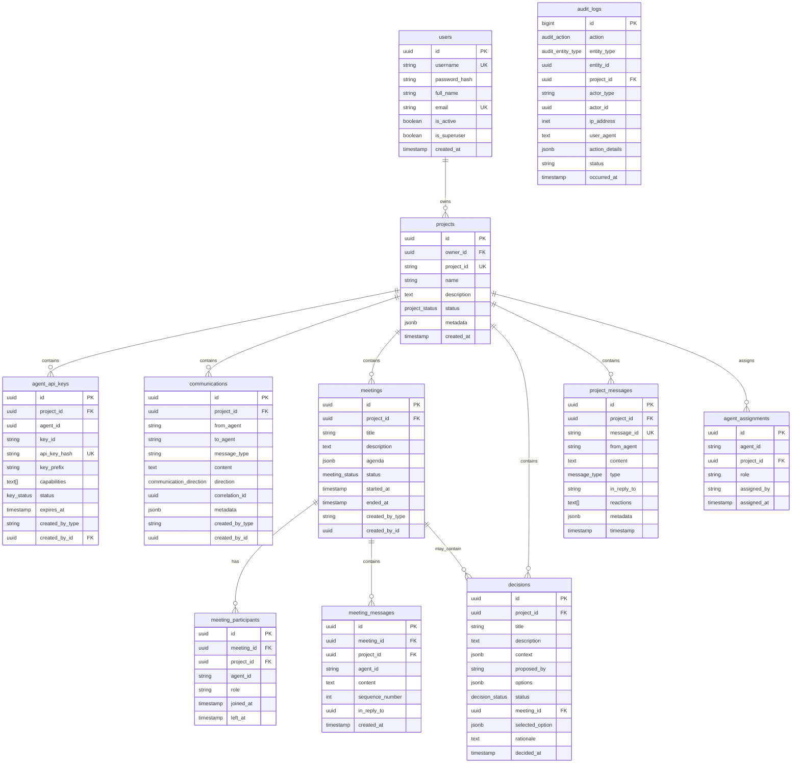

# Owner-centered Security & Permission Model - Database Schema Design

**Version:** 1.0.0
**Date:** 2026-02-02
**Platform:** Multi-Agent Collaboration Platform

## Table of Contents

1. [Overview](#overview)
2. [Security Model Principles](#security-model-principles)
3. [SQL Schema](#sql-schema)
4. [ERD Diagram](#erd-diagram)
5. [Migration Guide](#migration-guide)
6. [Repository Pattern](#repository-pattern)

---

## Overview

This schema implements an **Owner-Centered Security & Permission Model** where:

- **Humans (Owners)** have supreme authority over their projects
- **Agents** operate with project-bound API keys with limited capabilities
- **Row-Level Security (RLS)** ensures data isolation at project level
- **Audit logging** tracks all critical security actions

### Key Principles

1. **Project-Bound Access**: All data MUST be associated with a `project_id`
2. **Immutable Audit**: Critical actions are logged to an immutable audit table
3. **Creator Tracking**: All records track who created them (`created_by_type`, `created_by_id`)
4. **Structured API Keys**: Agent keys follow format: `sk_agent_[ver]_[project_id]_[agent_id]_[hash]`

### Technology Stack

- **Database:** PostgreSQL 16+ (for JSONB, RLS, UUID native support)
- **ORM:** SQLAlchemy 2.0 async
- **Migration:** Alembic

---

## Security Model Principles

### 1. Row-Level Security (RLS)

All queries MUST include `project_id` filter. RLS policies enforce this at database level:

```sql
-- Example RLS Policy
CREATE POLICY project_isolation ON communications
    USING (project_id = current_setting('app.current_project_id')::uuid);
```

### 2. API Key Structure

```
sk_agent_v1_550e8400_e29b_41d4_a716_446655440000_a1b2c3d4
│         │  │                    │                         │
│         │  │                    │                         └─ Hash (8 chars)
│         │  │                    └─────────────────────────── Agent UUID
│         │  └─────────────────────────────────────────────── Project UUID (first 8 chars)
│         └────────────────────────────────────────────────── Version
└───────────────────────────────────────────────────────────── Prefix
```

### 3. Mandatory Fields

All main tables include:
- `project_id` - UUID foreign key to projects
- `created_by_type` - Enum: 'human', 'agent', 'system'
- `created_by_id` - UUID of creator

---

## SQL Schema

### 1. Core Tables

#### 1.1 Users (Human Accounts)

```sql
-- ============================================================================
-- Table: users
-- Description: Human user accounts with authentication and project ownership
-- ============================================================================
CREATE TABLE users (
    -- Primary Key
    id UUID PRIMARY KEY DEFAULT gen_random_uuid(),

    -- Authentication
    username VARCHAR(100) NOT NULL UNIQUE,
    password_hash VARCHAR(255) NOT NULL,  -- bcrypt hash

    -- Profile
    full_name VARCHAR(200),
    email VARCHAR(255) UNIQUE,

    -- Status
    is_active BOOLEAN NOT NULL DEFAULT true,
    is_superuser BOOLEAN NOT NULL DEFAULT false,
    email_verified BOOLEAN NOT NULL DEFAULT false,

    -- Timestamps
    created_at TIMESTAMPTZ NOT NULL DEFAULT NOW(),
    updated_at TIMESTAMPTZ NOT NULL DEFAULT NOW(),
    last_login_at TIMESTAMPTZ,

    -- Constraints
    CONSTRAINT username_format CHECK (username ~ '^[a-zA-Z0-9_-]{3,30}$'),
    CONSTRAINT email_format CHECK (email ~ '^[A-Za-z0-9._%+-]+@[A-Za-z0-9.-]+\.[A-Za-z]{2,}$')
);

-- Indexes
CREATE INDEX idx_users_username ON users(username);
CREATE INDEX idx_users_email ON users(email);
CREATE INDEX idx_users_is_active ON users(is_active);

-- Comments
COMMENT ON TABLE users IS 'Human user accounts with system-wide access';
COMMENT ON COLUMN users.password_hash IS 'bcrypt hash with salt (cost 12)';
COMMENT ON COLUMN users.is_superuser IS 'Platform administrator with all permissions';
```

#### 1.2 Projects

```sql
-- ============================================================================
-- Table: projects
-- Description: Project entities owned by human users
-- ============================================================================
CREATE TYPE project_status AS ENUM ('active', 'inactive', 'suspended', 'archived');

CREATE TABLE projects (
    -- Primary Key
    id UUID PRIMARY KEY DEFAULT gen_random_uuid(),

    -- Ownership (Human supremacy)
    owner_id UUID NOT NULL REFERENCES users(id) ON DELETE RESTRICT,

    -- Identification
    project_id VARCHAR(100) NOT NULL UNIQUE,  -- Human-readable slug
    name VARCHAR(200) NOT NULL,
    description TEXT,

    -- Configuration
    max_agents INTEGER NOT NULL DEFAULT 100,
    max_sessions INTEGER NOT NULL DEFAULT 100,
    allow_cross_project BOOLEAN NOT NULL DEFAULT false,
    discoverable BOOLEAN NOT NULL DEFAULT true,

    -- Status
    status project_status NOT NULL DEFAULT 'active',

    -- Metadata (JSONB for flexibility)
    metadata JSONB NOT NULL DEFAULT '{}',
    tags VARCHAR(100)[] NOT NULL DEFAULT '{}',

    -- Timestamps
    created_at TIMESTAMPTZ NOT NULL DEFAULT NOW(),
    updated_at TIMESTAMPTZ NOT NULL DEFAULT NOW(),
    last_activity_at TIMESTAMPTZ NOT NULL DEFAULT NOW(),

    -- Constraints
    CONSTRAINT project_id_format CHECK (project_id ~ '^[a-z][a-z0-9_]*[a-z0-9]$'),
    CONSTRAINT max_agents_positive CHECK (max_agents > 0),
    CONSTRAINT max_sessions_positive CHECK (max_sessions > 0),

    -- Exclude reserved project IDs
    CONSTRAINT exclude_reserved_project_ids EXCLUDE (
        project_id WITH = WHERE (project_id IN ('default', 'system', 'admin', 'root'))
    )
);

-- Indexes
CREATE INDEX idx_projects_owner_id ON projects(owner_id);
CREATE INDEX idx_projects_project_id ON projects(project_id);
CREATE INDEX idx_projects_status ON projects(status);
CREATE INDEX idx_projects_tags ON projects USING GIN(tags);
CREATE INDEX idx_projects_metadata ON projects USING GIN(metadata);

-- Comments
COMMENT ON TABLE projects IS 'Projects owned by human users, containing agents and data';
COMMENT ON COLUMN projects.owner_id IS 'Human owner with supreme authority';
COMMENT ON COLUMN projects.project_id IS 'Human-readable project identifier (snake_case)';
```

#### 1.3 Agent API Keys

```sql
-- ============================================================================
-- Table: agent_api_keys
-- Description: Project-bound API keys for agent authentication
-- ============================================================================
CREATE TYPE key_status AS ENUM ('active', 'revoked', 'expired', 'disabled');

CREATE TABLE agent_api_keys (
    -- Primary Key
    id UUID PRIMARY KEY DEFAULT gen_random_uuid(),

    -- Project Binding (Security boundary)
    project_id UUID NOT NULL REFERENCES projects(id) ON DELETE CASCADE,

    -- Agent Association
    agent_id UUID NOT NULL,

    -- Key Information
    key_id VARCHAR(100) NOT NULL,  -- Human-readable key identifier
    api_key_hash VARCHAR(255) NOT NULL UNIQUE,  -- SHA-256 hash
    key_prefix VARCHAR(20) NOT NULL,  -- First chars for identification (sk_agent_v1_...)

    -- Capabilities (Permission scope)
    capabilities TEXT[] NOT NULL DEFAULT ARRAY['communicate'],  -- e.g., {communicate, create_meetings, manage_decisions}

    -- Status
    status key_status NOT NULL DEFAULT 'active',

    -- Lifecycle
    expires_at TIMESTAMPTZ,
    last_used_at TIMESTAMPTZ,
    revoked_at TIMESTAMPTZ,
    revoked_by_id UUID,
    revoke_reason TEXT,

    -- Metadata
    metadata JSONB NOT NULL DEFAULT '{}',

    -- Timestamps
    created_at TIMESTAMPTZ NOT NULL DEFAULT NOW(),
    updated_at TIMESTAMPTZ NOT NULL DEFAULT NOW(),

    -- Creator Tracking
    created_by_type VARCHAR(20) NOT NULL DEFAULT 'human',  -- 'human', 'agent', 'system'
    created_by_id UUID NOT NULL REFERENCES users(id),

    -- Constraints
    CONSTRAINT key_id_format CHECK (key_id ~ '^[a-z][a-z0-9_]*[a-z0-9]$'),
    CONSTRAINT valid_status_transition CHECK (
        (status = 'revoked' AND revoked_at IS NOT NULL) OR
        (status != 'revoked' AND revoked_at IS NULL)
    ),

    -- Unique constraint: One active key per key_id per project
    CONSTRAINT unique_active_key_per_project UNIQUE (project_id, key_id)
        WHERE (status = 'active')
);

-- Indexes
CREATE INDEX idx_agent_api_keys_project_id ON agent_api_keys(project_id);
CREATE INDEX idx_agent_api_keys_agent_id ON agent_api_keys(agent_id);
CREATE INDEX idx_agent_api_keys_api_key_hash ON agent_api_keys(api_key_hash);
CREATE INDEX idx_agent_api_keys_status ON agent_api_keys(status);
CREATE INDEX idx_agent_api_keys_expires_at ON agent_api_keys(expires_at);

-- Partial index for active, non-expired keys
CREATE INDEX idx_agent_api_keys_active_valid ON agent_api_keys(project_id, agent_id)
    WHERE (status = 'active' AND (expires_at IS NULL OR expires_at > NOW()));

-- Comments
COMMENT ON TABLE agent_api_keys IS 'Project-bound API keys for agent authentication';
COMMENT ON COLUMN agent_api_keys.api_key_hash IS 'SHA-256 hash of the API key';
COMMENT ON COLUMN agent_api_keys.key_prefix IS 'First characters for key identification (e.g., sk_agent_v1_...)';
COMMENT ON COLUMN agent_api_keys.capabilities IS 'Array of granted capabilities (communicate, create_meetings, etc.)';
```

### 2. Audit Tables

#### 2.1 Audit Logs (Immutable)

```sql
-- ============================================================================
-- Table: audit_logs
-- Description: Immutable audit trail for critical security actions
-- ============================================================================
CREATE TYPE audit_action AS ENUM (
    'create', 'update', 'delete', 'read',
    'login', 'logout', 'login_failed',
    'api_key_create', 'api_key_revoke',
    'agent_create', 'agent_delete',
    'project_create', 'project_update', 'project_delete',
    'permission_grant', 'permission_revoke',
    'cross_project_access'
);

CREATE TYPE audit_entity_type AS ENUM (
    'user', 'project', 'agent', 'api_key',
    'communication', 'meeting', 'decision',
    'project_message'
);

CREATE TABLE audit_logs (
    -- Primary Key
    id BIGSERIAL PRIMARY KEY,

    -- Action Information
    action audit_action NOT NULL,
    entity_type audit_entity_type NOT NULL,
    entity_id UUID NOT NULL,

    -- Project Context
    project_id UUID,

    -- Actor Information
    actor_type VARCHAR(20) NOT NULL,  -- 'human', 'agent', 'system'
    actor_id UUID NOT NULL,

    -- Target Information (if different from actor)
    target_type VARCHAR(20),
    target_id UUID,

    -- Details
    ip_address INET,
    user_agent TEXT,
    action_details JSONB NOT NULL DEFAULT '{}',

    -- Result
    status VARCHAR(20) NOT NULL DEFAULT 'success',  -- 'success', 'failure', 'partial'
    error_message TEXT,

    -- Timestamp
    occurred_at TIMESTAMPTZ NOT NULL DEFAULT NOW(),

    -- Constraints
    CONSTRAINT valid_actor_type CHECK (actor_type IN ('human', 'agent', 'system'))
);

-- Indexes
CREATE INDEX idx_audit_logs_project_id ON audit_logs(project_id);
CREATE INDEX idx_audit_logs_actor_id ON audit_logs(actor_id);
CREATE INDEX idx_audit_logs_entity ON audit_logs(entity_type, entity_id);
CREATE INDEX idx_audit_logs_action ON audit_logs(action);
CREATE INDEX idx_audit_logs_occurred_at ON audit_logs(occurred_at DESC);

-- Composite index for common queries
CREATE INDEX idx_audit_logs_project_action_time ON audit_logs(project_id, action, occurred_at DESC);

-- Partitioning (for large-scale deployments)
-- Uncomment if expecting high audit volume
-- CREATE TABLE audit_logs_y2024m01 PARTITION OF audit_logs
--     FOR VALUES FROM ('2024-01-01') TO ('2024-02-01');

-- Comments
COMMENT ON TABLE audit_logs IS 'Immutable audit trail for critical security actions';
COMMENT ON COLUMN audit_logs.action_details IS 'JSONB details about the action performed';
COMMENT ON COLUMN audit_logs.occurred_at IS 'Exact time when action occurred';

-- Security: Prevent modifications (app-level, PostgreSQL doesn't support immutable tables)
CREATE TRIGGER audit_logs_prevent_update
    BEFORE UPDATE ON audit_logs
    FOR EACH STATEMENT
    EXECUTE FUNCTION abort_update();

CREATE OR REPLACE FUNCTION abort_update() RETURNS trigger AS $$
BEGIN
    RAISE EXCEPTION 'Cannot modify immutable audit log';
END;
$$ LANGUAGE plpgsql;
```

### 3. Communication Tables (Updated with Mandatory Fields)

#### 3.1 Communications

```sql
-- ============================================================================
-- Table: communications
-- Description: Agent-to-agent messages with project isolation
-- ============================================================================
CREATE TYPE communication_direction AS ENUM ('inbound', 'outbound', 'internal');

CREATE TABLE communications (
    -- Primary Key
    id UUID PRIMARY KEY DEFAULT gen_random_uuid(),

    -- Project Context (MANDATORY for RLS)
    project_id UUID NOT NULL REFERENCES projects(id) ON DELETE CASCADE,

    -- Communication Details
    from_agent VARCHAR(255) NOT NULL,
    to_agent VARCHAR(255) NOT NULL,
    message_type VARCHAR(100) NOT NULL,
    content TEXT NOT NULL,

    -- Metadata
    direction communication_direction NOT NULL DEFAULT 'internal',
    correlation_id UUID,
    metadata JSONB NOT NULL DEFAULT '{}',

    -- Creator Tracking
    created_by_type VARCHAR(20) NOT NULL DEFAULT 'agent',
    created_by_id UUID NOT NULL,

    -- Timestamps
    created_at TIMESTAMPTZ NOT NULL DEFAULT NOW(),

    -- Constraints
    CONSTRAINT from_agent_not_empty CHECK (LENGTH(TRIM(from_agent)) > 0),
    CONSTRAINT to_agent_not_empty CHECK (LENGTH(TRIM(to_agent)) > 0),
    CONSTRAINT content_max_length CHECK (LENGTH(content) <= 100000)
);

-- Indexes
CREATE INDEX idx_communications_project_id ON communications(project_id);
CREATE INDEX idx_communications_from_agent ON communications(project_id, from_agent);
CREATE INDEX idx_communications_to_agent ON communications(project_id, to_agent);
CREATE INDEX idx_communications_correlation_id ON communications(correlation_id);
CREATE INDEX idx_communications_created_at ON communications(created_at DESC);

-- Comments
COMMENT ON TABLE communications IS 'Agent-to-agent messages with project-level isolation';
```

#### 3.2 Meetings

```sql
-- ============================================================================
-- Table: meetings
-- Description: Agent meetings with project isolation
-- ============================================================================
CREATE TYPE meeting_status AS ENUM ('pending', 'active', 'paused', 'completed', 'cancelled');

CREATE TABLE meetings (
    -- Primary Key
    id UUID PRIMARY KEY DEFAULT gen_random_uuid(),

    -- Project Context (MANDATORY for RLS)
    project_id UUID NOT NULL REFERENCES projects(id) ON DELETE CASCADE,

    -- Meeting Details
    title VARCHAR(200) NOT NULL,
    description VARCHAR(2000),
    agenda JSONB NOT NULL DEFAULT '[]',
    max_duration_seconds INTEGER,

    -- Status
    status meeting_status NOT NULL DEFAULT 'pending',

    -- Timestamps
    started_at TIMESTAMPTZ,
    ended_at TIMESTAMPTZ,

    -- Creator Tracking
    created_by_type VARCHAR(20) NOT NULL DEFAULT 'agent',
    created_by_id UUID NOT NULL,

    created_at TIMESTAMPTZ NOT NULL DEFAULT NOW(),
    updated_at TIMESTAMPTZ NOT NULL DEFAULT NOW(),

    -- Constraints
    CONSTRAINT title_not_empty CHECK (LENGTH(TRIM(title)) > 0),
    CONSTRAINT max_duration_positive CHECK (max_duration_seconds IS NULL OR max_duration_seconds > 0),
    CONSTRAINT max_duration_max CHECK (max_duration_seconds IS NULL OR max_duration_seconds <= 86400)
);

-- Indexes
CREATE INDEX idx_meetings_project_id ON meetings(project_id);
CREATE INDEX idx_meetings_status ON meetings(project_id, status);
CREATE INDEX idx_meetings_created_at ON meetings(created_at DESC);

-- Comments
COMMENT ON TABLE meetings IS 'Agent meetings with project-level isolation';
```

#### 3.3 Meeting Participants

```sql
-- ============================================================================
-- Table: meeting_participants
-- Description: Meeting participant tracking
-- ============================================================================
CREATE TABLE meeting_participants (
    -- Primary Key
    id UUID PRIMARY KEY DEFAULT gen_random_uuid(),

    -- Associations
    meeting_id UUID NOT NULL REFERENCES meetings(id) ON DELETE CASCADE,
    project_id UUID NOT NULL REFERENCES projects(id) ON DELETE CASCADE,

    -- Participant Details
    agent_id VARCHAR(255) NOT NULL,
    role VARCHAR(100) NOT NULL DEFAULT 'participant',

    -- Timestamps
    joined_at TIMESTAMPTZ NOT NULL DEFAULT NOW(),
    left_at TIMESTAMPTZ,

    -- Constraints
    CONSTRAINT agent_id_not_empty CHECK (LENGTH(TRIM(agent_id)) > 0)
);

-- Indexes
CREATE INDEX idx_meeting_participants_meeting_id ON meeting_participants(meeting_id);
CREATE INDEX idx_meeting_participants_project_id ON meeting_participants(project_id);
CREATE INDEX idx_meeting_participants_agent_id ON meeting_participants(agent_id);

-- Comments
COMMENT ON TABLE meeting_participants IS 'Meeting participants with project tracking';
```

#### 3.4 Meeting Messages

```sql
-- ============================================================================
-- Table: meeting_messages
-- Description: Messages within meetings
-- ============================================================================
CREATE TABLE meeting_messages (
    -- Primary Key
    id UUID PRIMARY KEY DEFAULT gen_random_uuid(),

    -- Associations
    meeting_id UUID NOT NULL REFERENCES meetings(id) ON DELETE CASCADE,
    project_id UUID NOT NULL REFERENCES projects(id) ON DELETE CASCADE,

    -- Message Details
    agent_id VARCHAR(255) NOT NULL,
    content TEXT NOT NULL,
    message_type VARCHAR(100) NOT NULL DEFAULT 'statement',
    sequence_number INTEGER NOT NULL,

    -- Reply Chain
    in_reply_to UUID,

    -- Creator Tracking
    created_by_type VARCHAR(20) NOT NULL DEFAULT 'agent',
    created_by_id UUID NOT NULL,

    created_at TIMESTAMPTZ NOT NULL DEFAULT NOW(),

    -- Constraints
    CONSTRAINT content_max_length CHECK (LENGTH(content) <= 50000)
);

-- Indexes
CREATE INDEX idx_meeting_messages_meeting_id ON meeting_messages(meeting_id);
CREATE INDEX idx_meeting_messages_project_id ON meeting_messages(project_id);
CREATE INDEX idx_meeting_messages_sequence ON meeting_messages(meeting_id, sequence_number);
CREATE INDEX idx_meeting_messages_in_reply_to ON meeting_messages(in_reply_to);

-- Comments
COMMENT ON TABLE meeting_messages IS 'Messages within meetings';
```

#### 3.5 Decisions

```sql
-- ============================================================================
-- Table: decisions
-- Description: Agent decisions with project isolation
-- ============================================================================
CREATE TYPE decision_status AS ENUM ('pending', 'approved', 'rejected', 'deferred');

CREATE TABLE decisions (
    -- Primary Key
    id UUID PRIMARY KEY DEFAULT gen_random_uuid(),

    -- Project Context (MANDATORY for RLS)
    project_id UUID NOT NULL REFERENCES projects(id) ON DELETE CASCADE,

    -- Decision Details
    title VARCHAR(200) NOT NULL,
    description TEXT NOT NULL,
    context JSONB NOT NULL DEFAULT '{}',
    proposed_by VARCHAR(255) NOT NULL,
    options JSONB NOT NULL DEFAULT '[]',

    -- Status
    status decision_status NOT NULL DEFAULT 'pending',

    -- Associations
    meeting_id UUID REFERENCES meetings(id) ON DELETE SET NULL,

    -- Outcome
    selected_option JSONB,
    rationale TEXT,

    -- Timing
    deadline TIMESTAMPTZ,
    decided_at TIMESTAMPTZ,

    -- Creator Tracking
    created_by_type VARCHAR(20) NOT NULL DEFAULT 'agent',
    created_by_id UUID NOT NULL,

    created_at TIMESTAMPTZ NOT NULL DEFAULT NOW(),
    updated_at TIMESTAMPTZ NOT NULL DEFAULT NOW(),

    -- Constraints
    CONSTRAINT title_not_empty CHECK (LENGTH(TRIM(title)) > 0),
    CONSTRAINT options_not_empty CHECK (jsonb_array_length(options) > 0)
);

-- Indexes
CREATE INDEX idx_decisions_project_id ON decisions(project_id);
CREATE INDEX idx_decisions_status ON decisions(project_id, status);
CREATE INDEX idx_decisions_meeting_id ON decisions(meeting_id);
CREATE INDEX idx_decisions_created_at ON decisions(created_at DESC);

-- Comments
COMMENT ON TABLE decisions IS 'Agent decisions with project-level isolation';
```

### 4. Project Chat Tables

#### 4.1 Project Messages

```sql
-- ============================================================================
-- Table: project_messages
-- Description: Direct project-based chat messages
-- ============================================================================
CREATE TYPE message_type AS ENUM ('statement', 'question', 'answer', 'notification');

CREATE TABLE project_messages (
    -- Primary Key
    id UUID PRIMARY KEY DEFAULT gen_random_uuid(),

    -- Project Context (MANDATORY for RLS)
    project_id UUID NOT NULL REFERENCES projects(id) ON DELETE CASCADE,

    -- Message Details
    message_id VARCHAR(100) NOT NULL UNIQUE,  -- Human-readable ID (msg-xxx)
    from_agent VARCHAR(255) NOT NULL,
    content TEXT NOT NULL,
    message_type message_type NOT NULL DEFAULT 'statement',

    -- Reply Chain
    in_reply_to VARCHAR(100),

    -- Reactions
    reactions TEXT[] NOT NULL DEFAULT '{}',

    -- Metadata
    metadata JSONB NOT NULL DEFAULT '{}',

    -- Creator Tracking
    created_by_type VARCHAR(20) NOT NULL DEFAULT 'agent',
    created_by_id UUID NOT NULL,

    timestamp TIMESTAMPTZ NOT NULL DEFAULT NOW(),

    -- Constraints
    CONSTRAINT content_max_length CHECK (LENGTH(content) <= 10000)
);

-- Indexes
CREATE INDEX idx_project_messages_project_id ON project_messages(project_id);
CREATE INDEX idx_project_messages_message_id ON project_messages(message_id);
CREATE INDEX idx_project_messages_from_agent ON project_messages(project_id, from_agent);
CREATE INDEX idx_project_messages_timestamp ON project_messages(timestamp DESC);
CREATE INDEX idx_project_messages_in_reply_to ON project_messages(in_reply_to);

-- Comments
COMMENT ON TABLE project_messages IS 'Project-based chat messages';
```

#### 4.2 Agent Assignments

```sql
-- ============================================================================
-- Table: agent_assignments
-- Description: Agent-to-project assignments
-- ============================================================================
CREATE TABLE agent_assignments (
    -- Primary Key
    id UUID PRIMARY KEY DEFAULT gen_random_uuid(),

    -- Associations
    agent_id VARCHAR(255) NOT NULL,
    project_id UUID NOT NULL REFERENCES projects(id) ON DELETE CASCADE,

    -- Assignment Details
    role VARCHAR(100) NOT NULL DEFAULT 'member',

    -- Creator Tracking
    assigned_by VARCHAR(255) NOT NULL,

    assigned_at TIMESTAMPTZ NOT NULL DEFAULT NOW(),

    -- Unique constraint: One assignment per agent per project
    CONSTRAINT unique_agent_per_project UNIQUE (agent_id, project_id)
);

-- Indexes
CREATE INDEX idx_agent_assignments_project_id ON agent_assignments(project_id);
CREATE INDEX idx_agent_assignments_agent_id ON agent_assignments(agent_id);

-- Comments
COMMENT ON TABLE agent_assignments IS 'Agent-to-project assignments';
```

---

## ERD Diagram



---

## Migration Guide

### Phase 1: Create New Tables

```sql
-- ============================================================================
-- Migration: 001_create_owner_security_schema.sql
-- Description: Create core tables for owner-centered security model
-- ============================================================================

-- Enable UUID extension
CREATE EXTENSION IF NOT EXISTS "uuid-ossp";

-- Create Custom Types
CREATE TYPE project_status AS ENUM ('active', 'inactive', 'suspended', 'archived');
CREATE TYPE key_status AS ENUM ('active', 'revoked', 'expired', 'disabled');
CREATE TYPE audit_action AS ENUM (
    'create', 'update', 'delete', 'read',
    'login', 'logout', 'login_failed',
    'api_key_create', 'api_key_revoke',
    'agent_create', 'agent_delete',
    'project_create', 'project_update', 'project_delete',
    'permission_grant', 'permission_revoke',
    'cross_project_access'
);
CREATE TYPE audit_entity_type AS ENUM (
    'user', 'project', 'agent', 'api_key',
    'communication', 'meeting', 'decision',
    'project_message'
);
CREATE TYPE communication_direction AS ENUM ('inbound', 'outbound', 'internal');
CREATE TYPE meeting_status AS ENUM ('pending', 'active', 'paused', 'completed', 'cancelled');
CREATE TYPE decision_status AS ENUM ('pending', 'approved', 'rejected', 'deferred');
CREATE TYPE message_type AS ENUM ('statement', 'question', 'answer', 'notification');

-- Create tables in order (respecting foreign key dependencies)
-- 1. users (no dependencies)
-- 2. projects (depends on users)
-- 3. agent_api_keys (depends on projects, users)
-- 4. communications (depends on projects)
-- 5. meetings (depends on projects)
-- 6. meeting_participants (depends on meetings)
-- 7. meeting_messages (depends on meetings)
-- 8. decisions (depends on projects, meetings)
-- 9. project_messages (depends on projects)
-- 10. agent_assignments (depends on projects)
-- 11. audit_logs (no dependencies, references other tables)

-- [Insert CREATE TABLE statements from SQL Schema section above]
```

### Phase 2: Migrate Existing Data

```sql
-- ============================================================================
-- Migration: 002_migrate_existing_data.sql
-- Description: Migrate data from old schema to new schema
-- ============================================================================

-- Step 1: Create default project for orphaned data
INSERT INTO projects (id, owner_id, project_id, name, description, status)
SELECT
    gen_random_uuid(),
    (SELECT id FROM users ORDER BY created_at LIMIT 1),  -- First user as owner
    'default',
    'Default Project',
    'Migrated data from legacy schema',
    'active'
ON CONFLICT (project_id) DO NOTHING;

-- Step 2: Add project_id to existing communications (if table exists without it)
DO $$
DECLARE
    default_project_id UUID;
BEGIN
    SELECT id INTO default_project_id FROM projects WHERE project_id = 'default';

    -- If communications table exists and needs migration
    IF EXISTS (SELECT FROM information_schema.tables WHERE table_name = 'communications') THEN
        -- Add project_id column if it doesn't exist
        IF NOT EXISTS (
            SELECT FROM information_schema.columns
            WHERE table_name = 'communications' AND column_name = 'project_id'
        ) THEN
            ALTER TABLE communications ADD COLUMN project_id UUID REFERENCES projects(id);

            -- Migrate existing records to default project
            UPDATE communications SET project_id = default_project_id WHERE project_id IS NULL;

            -- Make column NOT NULL after migration
            ALTER TABLE communications ALTER COLUMN project_id SET NOT NULL;
        END IF;
    END IF;
END $$;

-- Step 3: Add mandatory fields to existing tables
DO $$
BEGIN
    -- Add created_by_type and created_by_id to communications
    IF EXISTS (SELECT FROM information_schema.tables WHERE table_name = 'communications') THEN
        IF NOT EXISTS (
            SELECT FROM information_schema.columns
            WHERE table_name = 'communications' AND column_name = 'created_by_type'
        ) THEN
            ALTER TABLE communications ADD COLUMN created_by_type VARCHAR(20) DEFAULT 'agent';
            ALTER TABLE communications ADD COLUMN created_by_id UUID;
        END IF;
    END IF;

    -- Similar blocks for other tables...
END $$;
```

### Phase 3: Enable Row-Level Security

```sql
-- ============================================================================
-- Migration: 003_enable_rls.sql
-- Description: Enable Row-Level Security on all project-bound tables
-- ============================================================================

-- Enable RLS on all project-bound tables
ALTER TABLE communications ENABLE ROW LEVEL SECURITY;
ALTER TABLE meetings ENABLE ROW LEVEL SECURITY;
ALTER TABLE meeting_participants ENABLE ROW LEVEL SECURITY;
ALTER TABLE meeting_messages ENABLE ROW LEVEL SECURITY;
ALTER TABLE decisions ENABLE ROW LEVEL SECURITY;
ALTER TABLE project_messages ENABLE ROW LEVEL SECURITY;
ALTER TABLE agent_api_keys ENABLE ROW LEVEL SECURITY;

-- Create RLS policies for communications
CREATE POLICY communications_project_isolation ON communications
    FOR ALL
    USING (project_id = current_setting('app.current_project_id', true)::uuid);

CREATE POLICY communications_select ON communications
    FOR SELECT
    USING (project_id = current_setting('app.current_project_id', true)::uuid);

CREATE POLICY communications_insert ON communications
    FOR INSERT
    WITH CHECK (project_id = current_setting('app.current_project_id', true)::uuid);

-- Similar policies for other tables...
```

### Phase 4: Create Audit Log Trigger

```sql
-- ============================================================================
-- Migration: 004_create_audit_triggers.sql
-- Description: Create triggers for automatic audit logging
-- ============================================================================

-- Function to log changes to audit_logs
CREATE OR REPLACE FUNCTION audit_log_func() RETURNS trigger AS $$
DECLARE
    actor_type VARCHAR(20);
    actor_id UUID;
BEGIN
    -- Determine actor from application context
    actor_type := current_setting('app.actor_type', true);
    actor_id := current_setting('app.actor_id', true)::uuid;

    -- Log the action
    INSERT INTO audit_logs (
        action,
        entity_type,
        entity_id,
        project_id,
        actor_type,
        actor_id,
        action_details,
        status,
        occurred_at
    ) VALUES (
        TG_OP::audit_action,
        TG_TABLE_NAME::audit_entity_type,
        COALESCE(NEW.id, OLD.id),
        COALESCE(NEW.project_id, OLD.project_id),
        actor_type,
        actor_id,
        jsonb_build_object(
            'old', row_to_json(OLD),
            'new', row_to_json(NEW)
        ),
        'success',
        NOW()
    );

    IF TG_OP = 'DELETE' THEN
        RETURN OLD;
    ELSE
        RETURN NEW;
    END IF;
END;
$$ LANGUAGE plpgsql;

-- Create triggers on critical tables
CREATE TRIGGER audit_communications
    AFTER INSERT OR UPDATE OR DELETE ON communications
    FOR EACH ROW EXECUTE FUNCTION audit_log_func();

CREATE TRIGGER audit_meetings
    AFTER INSERT OR UPDATE OR DELETE ON meetings
    FOR EACH ROW EXECUTE FUNCTION audit_log_func();

CREATE TRIGGER audit_decisions
    AFTER INSERT OR UPDATE OR DELETE ON decisions
    FOR EACH ROW EXECUTE FUNCTION audit_log_func();

CREATE TRIGGER audit_api_keys
    AFTER INSERT OR UPDATE OR DELETE ON agent_api_keys
    FOR EACH ROW EXECUTE FUNCTION audit_log_func();
```

### Rollback Plan

```sql
-- ============================================================================
-- Rollback: 999_rollback_security_schema.sql
-- Description: Rollback owner-centered security schema
-- ============================================================================

-- Drop triggers
DROP TRIGGER IF EXISTS audit_communications ON communications;
DROP TRIGGER IF EXISTS audit_meetings ON meetings;
DROP TRIGGER IF EXISTS audit_decisions ON decisions;
DROP TRIGGER IF EXISTS audit_api_keys ON agent_api_keys;

-- Drop RLS policies
DROP POLICY IF EXISTS communications_project_isolation ON communications;
DROP POLICY IF EXISTS communications_select ON communications;
DROP POLICY IF EXISTS communications_insert ON communications;

-- Disable RLS
ALTER TABLE communications DISABLE ROW LEVEL SECURITY;
ALTER TABLE meetings DISABLE ROW LEVEL SECURITY;
ALTER TABLE meeting_participants DISABLE ROW LEVEL SECURITY;
ALTER TABLE meeting_messages DISABLE ROW LEVEL SECURITY;
ALTER TABLE decisions DISABLE ROW LEVEL SECURITY;
ALTER TABLE project_messages DISABLE ROW LEVEL SECURITY;
ALTER TABLE agent_api_keys DISABLE ROW LEVEL SECURITY;

-- Drop tables in reverse order of creation
DROP TABLE IF EXISTS audit_logs;
DROP TABLE IF EXISTS agent_assignments;
DROP TABLE IF EXISTS project_messages;
DROP TABLE IF EXISTS decisions;
DROP TABLE IF EXISTS meeting_messages;
DROP TABLE IF EXISTS meeting_participants;
DROP TABLE IF EXISTS meetings;
DROP TABLE IF EXISTS communications;
DROP TABLE IF EXISTS agent_api_keys;
DROP TABLE IF EXISTS projects;
DROP TABLE IF EXISTS users;

-- Drop types
DROP TYPE IF EXISTS message_type;
DROP TYPE IF EXISTS decision_status;
DROP TYPE IF EXISTS meeting_status;
DROP TYPE IF EXISTS communication_direction;
DROP TYPE IF EXISTS audit_entity_type;
DROP TYPE IF EXISTS audit_action;
DROP TYPE IF EXISTS key_status;
DROP TYPE IF EXISTS project_status;
```

---

## Repository Pattern

### Base Repository with Automatic project_id Injection

```python
# ============================================================================
# Base Repository with Automatic Project Context
# File: src/agent_comm_core/db/repository.py
# ============================================================================
from datetime import datetime
from typing import Any, Generic, TypeVar, Type
from uuid import UUID

from sqlalchemy import Select, UnaryExpression, select, update, delete
from sqlalchemy.ext.asyncio import AsyncSession
from sqlalchemy.orm import DeclarativeBase

from agent_comm_core.db.base import Base


ModelType = TypeVar("ModelType", bound=Base)


class BaseRepository(Generic[ModelType]):
    """
    Base repository with automatic project_id injection for RLS.

    All queries automatically include project_id filter for Row-Level Security.
    """

    def __init__(self, model: Type[ModelType], session: AsyncSession):
        """
        Initialize repository with model and session.

        Args:
            model: SQLAlchemy model class
            session: Async database session
        """
        self.model = model
        self.session = session

    def _set_project_context(self, project_id: UUID) -> None:
        """
        Set PostgreSQL session variable for RLS.

        This sets app.current_project_id which is used by RLS policies.

        Args:
            project_id: Project UUID for current request context
        """
        from sqlalchemy import text

        self.session.execute(
            text("SET LOCAL app.current_project_id = :project_id"),
            {"project_id": str(project_id)}
        )

    def _set_actor_context(self, actor_type: str, actor_id: UUID) -> None:
        """
        Set actor context for audit logging.

        Args:
            actor_type: Type of actor ('human', 'agent', 'system')
            actor_id: UUID of the actor
        """
        from sqlalchemy import text

        self.session.execute(
            text("SET LOCAL app.actor_type = :actor_type"),
            {"actor_type": actor_type}
        )
        self.session.execute(
            text("SET LOCAL app.actor_id = :actor_id"),
            {"actor_id": str(actor_id)}
        )

    async def get_by_id(
        self,
        id: UUID,
        project_id: UUID,
        *,
        options: list | None = None
    ) -> ModelType | None:
        """
        Get entity by ID with automatic project_id filtering.

        Args:
            id: Entity UUID
            project_id: Project UUID for RLS
            options: Optional SQLAlchemy loader options

        Returns:
            Entity or None if not found
        """
        self._set_project_context(project_id)

        stmt = select(self.model).where(self.model.id == id)

        if options:
            for option in options:
                stmt = stmt.options(option)

        result = await self.session.execute(stmt)
        return result.scalar_one_or_none()

    async def list(
        self,
        project_id: UUID,
        *,
        where: Any | None = None,
        order_by: UnaryExpression | list[UnaryExpression] | None = None,
        limit: int | None = None,
        offset: int | None = None,
        options: list | None = None
    ) -> list[ModelType]:
        """
        List entities with automatic project_id filtering.

        Args:
            project_id: Project UUID for RLS
            where: Optional WHERE clause
            order_by: Optional ORDER BY clause
            limit: Optional LIMIT
            offset: Optional OFFSET
            options: Optional SQLAlchemy loader options

        Returns:
            List of entities
        """
        self._set_project_context(project_id)

        stmt = select(self.model)

        if where is not None:
            stmt = stmt.where(where)

        if order_by is not None:
            if isinstance(order_by, list):
                stmt = stmt.order_by(*order_by)
            else:
                stmt = stmt.order_by(order_by)

        if limit is not None:
            stmt = stmt.limit(limit)

        if offset is not None:
            stmt = stmt.offset(offset)

        if options:
            for option in options:
                stmt = stmt.options(option)

        result = await self.session.execute(stmt)
        return list(result.scalars().all())

    async def create(
        self,
        obj: ModelType,
        project_id: UUID,
        actor_type: str = "agent",
        actor_id: UUID | None = None
    ) -> ModelType:
        """
        Create entity with automatic context setting.

        Args:
            obj: Entity to create
            project_id: Project UUID for RLS
            actor_type: Type of actor creating this entity
            actor_id: UUID of actor (defaults to created_by_id on obj)

        Returns:
            Created entity
        """
        self._set_project_context(project_id)
        self._set_actor_context(
            actor_type,
            actor_id or getattr(obj, "created_by_id", None)
        )

        self.session.add(obj)
        await self.session.flush()
        await self.session.refresh(obj)

        return obj

    async def update(
        self,
        id: UUID,
        project_id: UUID,
        **kwargs: Any
    ) -> ModelType | None:
        """
        Update entity by ID with automatic project_id filtering.

        Args:
            id: Entity UUID
            project_id: Project UUID for RLS
            **kwargs: Fields to update

        Returns:
            Updated entity or None if not found
        """
        self._set_project_context(project_id)

        # Set updated_at if model has it
        if hasattr(self.model, "updated_at"):
            kwargs["updated_at"] = datetime.utcnow()

        stmt = (
            update(self.model)
            .where(self.model.id == id)
            .values(**kwargs)
            .returning(self.model)
        )

        result = await self.session.execute(stmt)
        return result.scalar_one_or_none()

    async def delete(
        self,
        id: UUID,
        project_id: UUID
    ) -> bool:
        """
        Delete entity by ID with automatic project_id filtering.

        Args:
            id: Entity UUID
            project_id: Project UUID for RLS

        Returns:
            True if deleted, False if not found
        """
        self._set_project_context(project_id)

        stmt = delete(self.model).where(self.model.id == id)
        result = await self.session.execute(stmt)

        return result.rowcount > 0

    async def exists(
        self,
        id: UUID,
        project_id: UUID
    ) -> bool:
        """
        Check if entity exists with automatic project_id filtering.

        Args:
            id: Entity UUID
            project_id: Project UUID for RLS

        Returns:
            True if exists, False otherwise
        """
        self._set_project_context(project_id)

        stmt = select(self.model.id).where(self.model.id == id)
        result = await self.session.execute(stmt)

        return result.scalar_one_or_none() is not None

    async def count(
        self,
        project_id: UUID,
        *,
        where: Any | None = None
    ) -> int:
        """
        Count entities with automatic project_id filtering.

        Args:
            project_id: Project UUID for RLS
            where: Optional WHERE clause

        Returns:
            Count of entities
        """
        from sqlalchemy import func

        self._set_project_context(project_id)

        stmt = select(func.count()).select_from(self.model)

        if where is not None:
            stmt = stmt.where(where)

        result = await self.session.execute(stmt)
        return result.scalar() or 0


# ============================================================================
# Example Implementation: CommunicationRepository
# ============================================================================
class CommunicationRepository(BaseRepository["CommunicationDB"]):
    """
    Repository for communications with domain-specific queries.
    """

    def __init__(self, session: AsyncSession):
        """
        Initialize communication repository.

        Args:
            session: Async database session
        """
        from agent_comm_core.db.communication import CommunicationDB
        super().__init__(CommunicationDB, session)

    async def get_by_correlation_id(
        self,
        correlation_id: UUID,
        project_id: UUID
    ) -> list["CommunicationDB"]:
        """
        Get all communications with the same correlation ID.

        Args:
            correlation_id: Correlation UUID
            project_id: Project UUID for RLS

        Returns:
            List of related communications
        """
        self._set_project_context(project_id)

        stmt = select(self.model).where(
            self.model.correlation_id == correlation_id
        ).order_by(self.model.created_at)

        result = await self.session.execute(stmt)
        return list(result.scalars().all())

    async def get_conversation(
        self,
        agent_a: str,
        agent_b: str,
        project_id: UUID,
        *,
        limit: int = 100
    ) -> list["CommunicationDB"]:
        """
        Get conversation between two agents.

        Args:
            agent_a: First agent ID
            agent_b: Second agent ID
            project_id: Project UUID for RLS
            limit: Maximum messages to return

        Returns:
            List of communications in chronological order
        """
        self._set_project_context(project_id)

        stmt = select(self.model).where(
            (self.model.from_agent == agent_a) & (self.model.to_agent == agent_b) |
            (self.model.from_agent == agent_b) & (self.model.to_agent == agent_a)
        ).order_by(self.model.created_at).limit(limit)

        result = await self.session.execute(stmt)
        return list(result.scalars().all())

    async def get_by_direction(
        self,
        direction: "CommunicationDirection",
        project_id: UUID,
        *,
        limit: int = 100
    ) -> list["CommunicationDB"]:
        """
        Get communications by direction.

        Args:
            direction: Communication direction
            project_id: Project UUID for RLS
            limit: Maximum results

        Returns:
            List of communications
        """
        from agent_comm_core.db.communication import CommunicationDirection

        self._set_project_context(project_id)

        stmt = select(self.model).where(
            self.model.direction == direction
        ).order_by(self.model.created_at.desc()).limit(limit)

        result = await self.session.execute(stmt)
        return list(result.scalars().all())


# ============================================================================
# Usage Example
# ============================================================================
# In your service layer or API endpoint:
#
# from agent_comm_core.db.repository import CommunicationRepository
# from sqlalchemy.ext.asyncio import AsyncSession
#
# async def get_communications(
#     session: AsyncSession,
#     project_id: UUID,
#     user_id: UUID
# ) -> list[Communication]:
#     """
#     Get all communications for a project.
#
#     The repository automatically:
#     - Sets app.current_project_id for RLS
#     - Filters by project_id
#     - Logs actions to audit_logs
#     """
#     repo = CommunicationRepository(session)
#     return await repo.list(project_id, order_by=CommunicationDB.created_at.desc())
```

### SQLAlchemy Model Updates

Updated ORM models with mandatory fields:

```python
# ============================================================================
# Updated CommunicationDB Model with Mandatory Fields
# File: src/communication_server/db/communication.py
# ============================================================================
from datetime import datetime
from enum import Enum
from typing import Optional
from uuid import UUID

from sqlalchemy import DateTime, Enum as SQLEnum, ForeignKey, String, Text
from sqlalchemy.dialects.postgresql import UUID as PGUUID
from sqlalchemy.orm import Mapped, mapped_column

from agent_comm_core.db.base import Base


class CommunicationDirection(str, Enum):
    """Direction of communication."""
    INBOUND = "inbound"
    OUTBOUND = "outbound"
    INTERNAL = "internal"


class CommunicationDB(Base):
    """
    SQLAlchemy ORM model for communications with mandatory fields.
    """

    __tablename__ = "communications"

    # Project Context (MANDATORY for RLS)
    project_id: Mapped[UUID] = mapped_column(
        PGUUID(as_uuid=True),
        ForeignKey("projects.id", ondelete="CASCADE"),
        nullable=False,
        index=True,
    )

    # Communication Details
    from_agent: Mapped[str] = mapped_column(String(255), nullable=False, index=True)
    to_agent: Mapped[str] = mapped_column(String(255), nullable=False, index=True)
    message_type: Mapped[str] = mapped_column(String(100), nullable=False)
    content: Mapped[str] = mapped_column(Text, nullable=False)
    direction: Mapped[CommunicationDirection] = mapped_column(
        SQLEnum(CommunicationDirection),
        default=CommunicationDirection.INTERNAL,
        nullable=False,
        index=True,
    )
    correlation_id: Mapped[Optional[UUID]] = mapped_column(
        PGUUID(as_uuid=True), nullable=True, index=True
    )
    meta_data: Mapped[str] = mapped_column("metadata", Text, default="{}", nullable=False)

    # Creator Tracking (MANDATORY)
    created_by_type: Mapped[str] = mapped_column(
        String(20),
        nullable=False,
        default="agent",
        server_default="agent"
    )
    created_by_id: Mapped[UUID] = mapped_column(
        PGUUID(as_uuid=True),
        nullable=False
    )

    # Timestamps
    created_at: Mapped[datetime] = mapped_column(
        DateTime(timezone=True), default=datetime.utcnow, nullable=False
    )
```

---

## Summary

This schema implements a comprehensive **Owner-centered Security & Permission Model** with:

### Key Features

1. **Project-Bound Security**: All data is isolated at project level via `project_id` foreign keys and RLS policies
2. **Human Supremacy**: Projects are owned by human users who have supreme authority
3. **Structured API Keys**: Agent keys follow `sk_agent_[ver]_[project_id]_[agent_id]_[hash]` format
4. **Immutable Audit Logs**: All critical actions are logged to append-only audit table
5. **Creator Tracking**: Every record tracks who created it via `created_by_type` and `created_by_id`

### Implementation Checklist

- [ ] Create all tables with proper foreign keys
- [ ] Add indexes for performance
- [ ] Enable Row-Level Security policies
- [ ] Create audit log triggers
- [ ] Implement BaseRepository with automatic context injection
- [ ] Update ORM models with mandatory fields
- [ ] Migrate existing data to default project
- [ ] Test RLS policies prevent cross-project access
- [ ] Verify audit logging captures all critical actions

### Performance Considerations

- **Indexes**: Created on all foreign keys and frequently queried columns
- **JSONB**: Used for flexible metadata with GIN indexes
- **Partitioning**: Ready for audit_logs partitioning if needed
- **Connection Pooling**: Configure PgBouncer or SQLAlchemy pool for production

### Security Checklist

- [ ] All tables have `project_id` for RLS
- [ ] RLS policies enabled and tested
- [ ] Audit logging captures all critical actions
- [ ] API keys are hashed (SHA-256)
- [ ] Passwords are hashed (bcrypt cost 12)
- [ ] Project ownership cannot be transferred without explicit action
- [ ] Agent keys are project-bound and cannot access other projects
