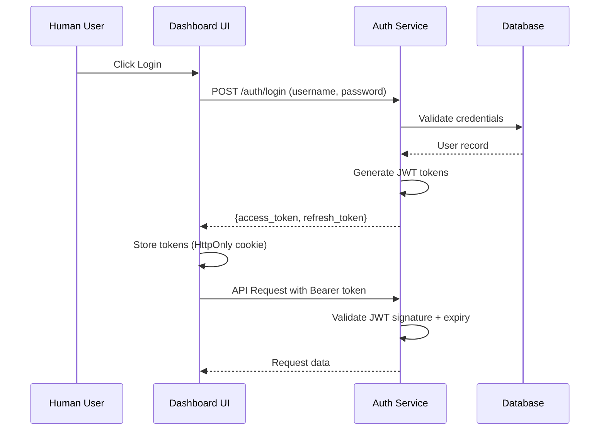
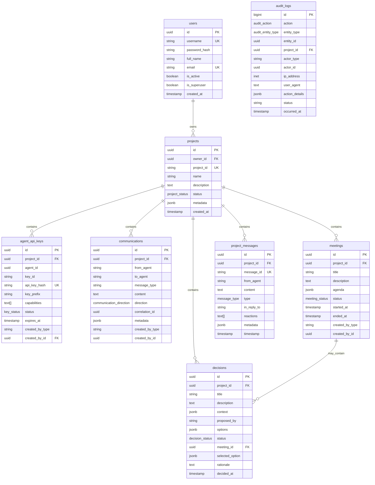

# SPEC-SECURITY-001: Owner-Centered Security & Permission System

**Version:** 1.0.0
**Status:** Planned
**Created:** 2026-02-02
**Priority:** High

---

## TAG BLOCK

```yaml
tags:
  - security
  - authentication
  - authorization
  - database
  - rls
  - audit-logging
  - multi-tenancy

domains:
  - backend
  - database

dependencies:
  - None (Foundational SPEC)

related_specs:
  - SPEC-MCP-BROKER-001
  - SPEC-AGENT-COMM-001
```

---

## 1. Environment

### 1.1 System Context

The Multi-Agent Collaboration Platform currently implements basic authentication but lacks:

1. **Multi-tenancy support** - All data is in a shared context without project isolation
2. **Row-Level Security (RLS)** - No database-level access control
3. **Immutable audit logging** - Security events are not properly tracked
4. **Owner-centered permissions** - No human supremacy model
5. **Structured API keys** - Agent keys lack project binding and capability scoping

### 1.2 Current Limitations

**Current Authentication Model:**
- Simple JWT tokens for dashboard users
- Basic API tokens for agents without scoping
- No project-level data isolation
- No audit trail for security events
- No capability-based permissions

**Database Limitations:**
- Tables lack `project_id` foreign keys
- No Row-Level Security policies
- No creator tracking (`created_by_type`, `created_by_id`)
- No audit log infrastructure

### 1.3 Assumptions

| Assumption | Confidence | Validation Method |
|------------|------------|-------------------|
| PostgreSQL 16+ available | High | Check existing DB version |
| SQLAlchemy 2.0 already in use | High | Check pyproject.toml |
| Existing users table exists | Medium | Database inspection |
| Existing projects table exists | High | Architecture review |
| Alembic configured for migrations | High | Check migrations directory |

---

## 2. Requirements (EARS Format)

### 2.1 Ubiquitous Requirements (Always Active)

**REQ-SEC-001:** The system SHALL validate all API requests against project-bound Row-Level Security policies.

**REQ-SEC-002:** The system SHALL log all critical security actions to an immutable audit log table.

**REQ-SEC-003:** The system SHALL associate all data with a `project_id` for multi-tenancy isolation.

**REQ-SEC-004:** The system SHALL track the creator of every record via `created_by_type` and `created_by_id` fields.

### 2.2 Event-Driven Requirements

**REQ-SEC-101:** WHEN a human user creates a project, THEN the system SHALL assign them as owner with supreme authority.

**REQ-SEC-102:** WHEN an agent authenticates, THEN the system SHALL validate its API key against project_id binding.

**REQ-SEC-103:** WHEN a query is executed, THEN the system SHALL automatically inject `project_id` filter via RLS.

**REQ-SEC-104:** WHEN a critical action occurs (create, update, delete, auth), THEN the system SHALL log to audit_logs table.

**REQ-SEC-105:** WHEN an API key is created, THEN the system SHALL generate structured format: `sk_agent_[ver]_[project_id]_[agent_id]_[hash]`.

**REQ-SEC-106:** WHEN cross-project access is attempted, THEN the system SHALL validate against explicit permission settings.

### 2.3 State-Driven Requirements

**REQ-SEC-201:** IF a project has `allow_cross_project = false`, THEN the system SHALL reject all cross-project requests.

**REQ-SEC-202:** IF an agent's API key is expired or revoked, THEN the system SHALL deny access with 401 Unauthorized.

**REQ-SEC-203:** IF an audit log record exists, THEN the system SHALL prevent any modifications (immutable).

**REQ-SEC-204:** IF a user is marked as `is_superuser = true`, THEN the system SHALL grant access to all projects.

### 2.4 Unwanted Requirements (Prohibited)

**REQ-SEC-301:** The system SHALL NOT allow agents to access data from projects they are not bound to.

**REQ-SEC-302:** The system SHALL NOT allow modification of audit log records once written.

**REQ-SEC-303:** The system SHALL NOT allow project ownership transfer without explicit human action.

**REQ-SEC-304:** The system SHALL NOT store API keys in plaintext (SHA-256 hash required).

**REQ-SEC-305:** The system SHALL NOT allow queries that bypass project_id filtering.

### 2.5 Optional Requirements (Enhancement)

**REQ-SEC-401:** WHERE possible, the system SHALL support rate limiting at agent level.

**REQ-SEC-402:** WHERE possible, the system SHALL provide a panic endpoint for emergency agent revocation.

**REQ-SEC-403:** WHERE possible, the system SHALL support audit log partitioning for high-volume deployments.

---

## 3. Specifications

### 3.1 Authentication Architecture

#### 3.1.1 Dual-Track Authentication

```
                    User Request
                          │
                          ▼
              ┌─────────────────────┐
              │  Auth Middleware    │
              └─────────────────────┘
                          │
            ┌─────────────┴─────────────┐
            │                           │
            ▼                           ▼
    ┌──────────────┐          ┌──────────────┐
    │   OAuth 2.0  │          │ Scoped API   │
    │   (Humans)   │          │ Key (Agents) │
    └──────────────┘          └──────────────┘
            │                           │
            ▼                           ▼
    JWT Access Token           Agent Token Validation
    + Refresh Token            + Capability Check
    + User Profile             + Project Binding
```

#### 3.1.2 OAuth 2.0 Flow (Humans)



#### 3.1.3 Agent API Key Structure

```
Format: sk_agent_v1_{project_id}_{agent_id}_{hash}

Example: sk_agent_v1_550e8400_e29b_41d4_a716_446655440000_a1b2c3d4

Components:
- Prefix: sk_agent (identifies service key type)
- Version: v1 (key format version)
- Project ID: First 8 chars of project UUID
- Agent ID: Full agent UUID
- Hash: 8-character random hash

Validation:
1. Parse format to extract project_id and agent_id
2. Hash comparison with stored SHA-256 hash
3. Verify key status (active, not expired, not revoked)
4. Check capabilities against requested operation
```

### 3.2 Database Schema

#### 3.2.1 Entity Relationship Diagram



#### 3.2.2 Row-Level Security Policies

```sql
-- Enable RLS on all project-bound tables
ALTER TABLE communications ENABLE ROW LEVEL SECURITY;
ALTER TABLE meetings ENABLE ROW LEVEL SECURITY;
ALTER TABLE meeting_messages ENABLE ROW LEVEL SECURITY;
ALTER TABLE decisions ENABLE ROW LEVEL SECURITY;
ALTER TABLE project_messages ENABLE ROW LEVEL SECURITY;
ALTER TABLE agent_api_keys ENABLE ROW LEVEL SECURITY;

-- Policy: Project Isolation
CREATE POLICY project_isolation ON communications
    FOR ALL
    USING (project_id = current_setting('app.current_project_id')::uuid);

CREATE POLICY project_isolation ON meetings
    FOR ALL
    USING (project_id = current_setting('app.current_project_id')::uuid);

CREATE POLICY project_isolation ON decisions
    FOR ALL
    USING (project_id = current_setting('app.current_project_id')::uuid);

CREATE POLICY project_isolation ON project_messages
    FOR ALL
    USING (project_id = current_setting('app.current_project_id')::uuid);

CREATE POLICY project_isolation ON agent_api_keys
    FOR ALL
    USING (project_id = current_setting('app.current_project_id')::uuid);
```

### 3.3 API Endpoints

#### 3.3.1 Authentication Endpoints

| Method | Endpoint | Description | Auth Required |
|--------|----------|-------------|---------------|
| POST | `/api/v1/auth/login` | User login (OAuth) | No |
| POST | `/api/v1/auth/refresh` | Refresh access token | No |
| POST | `/api/v1/auth/logout` | Invalidate refresh token | Yes (JWT) |
| GET | `/api/v1/auth/me` | Get current user profile | Yes (JWT) |
| POST | `/api/v1/auth/agent-keys` | Create agent API key | Yes (JWT, Admin) |
| GET | `/api/v1/auth/agent-keys` | List agent API keys | Yes (JWT) |
| DELETE | `/api/v1/auth/agent-keys/{id}` | Revoke agent API key | Yes (JWT, Admin) |

#### 3.3.2 Project Management Endpoints

| Method | Endpoint | Description | Auth Required |
|--------|----------|-------------|---------------|
| GET | `/api/v1/projects` | List user projects | Yes (JWT) |
| POST | `/api/v1/projects` | Create new project | Yes (JWT) |
| GET | `/api/v1/projects/{id}` | Get project details | Yes (JWT, Owner) |
| PUT | `/api/v1/projects/{id}` | Update project | Yes (JWT, Owner) |
| DELETE | `/api/v1/projects/{id}` | Delete project | Yes (JWT, Owner) |
| GET | `/api/v1/projects/{id}/agents` | List project agents | Yes (JWT, Owner) |
| POST | `/api/v1/projects/{id}/agents` | Invite agent to project | Yes (JWT, Owner) |
| DELETE | `/api/v1/projects/{id}/agents/{agent_id}` | Remove agent from project | Yes (JWT, Owner) |

#### 3.3.3 Audit Log Endpoints

| Method | Endpoint | Description | Auth Required |
|--------|----------|-------------|---------------|
| GET | `/api/v1/audit-logs` | Query audit logs | Yes (JWT, Admin) |
| GET | `/api/v1/audit-logs/{id}` | Get audit log entry | Yes (JWT, Admin) |
| GET | `/api/v1/projects/{id}/audit-logs` | Query project audit logs | Yes (JWT, Owner) |

#### 3.3.4 Security Endpoints

| Method | Endpoint | Description | Auth Required |
|--------|----------|-------------|---------------|
| POST | `/api/v1/security/panic` | Emergency revoke all keys | Yes (JWT, Superuser) |
| GET | `/api/v1/security/status` | Get security status | Yes (JWT, Admin) |
| POST | `/api/v1/security/rotate-keys` | Rotate project API keys | Yes (JWT, Owner) |

### 3.4 Permission Matrix (RBAC)

#### 3.4.1 Human User Permissions

| Resource | Owner | Admin | Superuser |
|----------|-------|-------|-----------|
| Create projects | Yes | No | Yes |
| View own projects | Yes | Yes | Yes |
| Edit own projects | Yes | No | Yes |
| Delete own projects | Yes | No | Yes |
| Create agent keys | Yes | No | Yes |
| Revoke agent keys | Yes | No | Yes |
| View audit logs (own) | Yes | Yes | Yes |
| View audit logs (all) | No | Yes | Yes |
| Emergency panic | No | No | Yes |

#### 3.4.2 Agent Capabilities

| Capability | Description | Scope |
|------------|-------------|-------|
| `communicate` | Send/receive messages | Project-bound |
| `create_meetings` | Create and manage meetings | Project-bound |
| `propose_decisions` | Create decision proposals | Project-bound |
| `view_decisions` | Read decision records | Project-bound |
| `manage_decisions` | Execute decision actions | Project-bound |
| `project_chat` | Send project messages | Project-bound |

### 3.5 Security Measures

#### 3.5.1 Rate Limiting

```python
# Agent-level rate limiting
@router.post("/api/v1/communications")
@rate_limit(
    requests_per_minute=60,
    key_func=lambda: get_agent_id_from_token(),
    scope="project"  # Per-project limits
)
async def log_communication(
    data: CommunicationCreate,
    agent: Agent = Depends(require_agent)
):
    pass
```

#### 3.5.2 Kill Switch (Panic Endpoint)

```python
@router.post("/api/v1/security/panic")
async def emergency_panic(
    user: User = Depends(get_current_superuser),
    reason: str
):
    """
    Emergency endpoint to revoke all agent keys immediately.
    Requires superuser privileges.
    """
    # Revoke all active agent_api_keys
    # Log to audit_logs with action='panic'
    # Send notification to all active sessions
```

#### 3.5.3 API Key Validation Middleware

```python
class SecurityMiddleware(BaseHTTPMiddleware):
    async def dispatch(self, request: Request, call_next):
        # Extract token from header
        token = request.headers.get("Authorization", "").replace("Bearer ", "")

        # Determine token type
        if token.startswith("sk_agent_"):
            # Agent token validation
            project_id = await validate_agent_token(token)
            if not project_id:
                raise HTTPException(401, "Invalid agent token")
            # Set project context for RLS
            await set_project_context(project_id)
        elif token:
            # JWT validation
            user = await validate_jwt_token(token)
            request.state.user = user

        response = await call_next(request)
        return response
```

### 3.6 Migration Plan

#### Phase 1: Create Core Tables (Migration 001)

1. Create `users` table with authentication fields
2. Create `projects` table with owner_id foreign key
3. Create `agent_api_keys` table with project binding
4. Add indexes for performance

#### Phase 2: Add Mandatory Fields (Migration 002)

1. Add `project_id` to all existing tables
2. Add `created_by_type` and `created_by_id` to all tables
3. Migrate existing data to default project
4. Make columns NOT NULL after migration

#### Phase 3: Enable RLS (Migration 003)

1. Enable Row-Level Security on all project-bound tables
2. Create RLS policies for each table
3. Test policies prevent cross-project access

#### Phase 4: Audit Infrastructure (Migration 004)

1. Create `audit_logs` table
2. Create audit trigger function
3. Add triggers to critical tables
4. Implement immutability protection

#### Phase 5: Cross-Project Permissions (Migration 005) - Optional

1. Create `cross_project_permissions` table
2. Add `allow_cross_project` column to projects
3. Implement permission validation logic

---

## 4. Traceability

### Requirement to Component Mapping

| Requirement | Component | Status |
|-------------|-----------|--------|
| REQ-SEC-001 | RLS Policies | New |
| REQ-SEC-002 | Audit Logs | New |
| REQ-SEC-003 | Database Schema | New |
| REQ-SEC-004 | Database Schema | New |
| REQ-SEC-101 | Project Service | New |
| REQ-SEC-102 | API Key Validation | New |
| REQ-SEC-103 | Repository Base | Update |
| REQ-SEC-104 | Audit Triggers | New |
| REQ-SEC-105 | API Key Service | New |
| REQ-SEC-106 | Cross-Project Router | New |

### File Changes Summary

**New Files:**
- `src/agent_comm_core/db/models/user.py` - User ORM model
- `src/agent_comm_core/db/models/project.py` - Project ORM model
- `src/agent_comm_core/db/models/agent_api_key.py` - Agent API Key model
- `src/agent_comm_core/db/models/audit_log.py` - Audit Log model
- `src/agent_comm_core/auth/service.py` - Authentication service
- `src/agent_comm_core/auth/jwt.py` - JWT token utilities
- `src/agent_comm_core/auth/api_key.py` - API Key utilities
- `src/communication_server/security/middleware.py` - Security middleware
- `src/communication_server/api/v1/auth.py` - Auth endpoints
- `src/communication_server/api/v1/projects.py` - Project endpoints
- `src/communication_server/api/v1/audit_logs.py` - Audit log endpoints
- `src/communication_server/api/v1/security.py` - Security endpoints

**Modified Files:**
- `src/agent_comm_core/db/repository.py` - Add project context injection
- All existing ORM models - Add mandatory fields
- `src/communication_server/main.py` - Add security middleware
- All migration files - Add security schema migrations

---

## 5. References

### Internal Documents

- `.moai/docs/database-schema-owner-security.md` - Complete SQL schema
- `docs/SECURITY.md` - Current authentication implementation
- `docs/SYSTEM_ARCHITECTURE.md` - System architecture overview

### External Standards

- [RFC 6749 - OAuth 2.0](https://datatracker.ietf.org/doc/html/rfc6749)
- [OWASP Top 10](https://owasp.org/www-project-top-ten/)
- [PostgreSQL Row-Level Security](https://www.postgresql.org/docs/current/ddl-rowsecurity.html)
- [JWT Best Practices](https://tools.ietf.org/html/rfc8725)

---

**Document Owner:** Security Team
**Review Date:** 2026-02-15
**Approved By:** Pending
