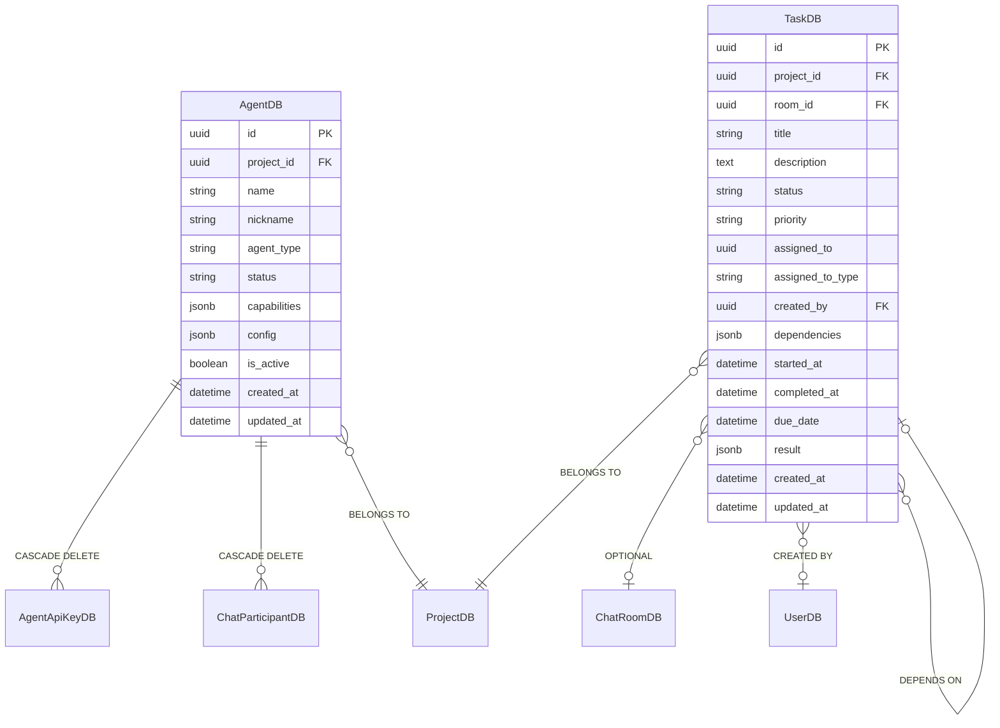
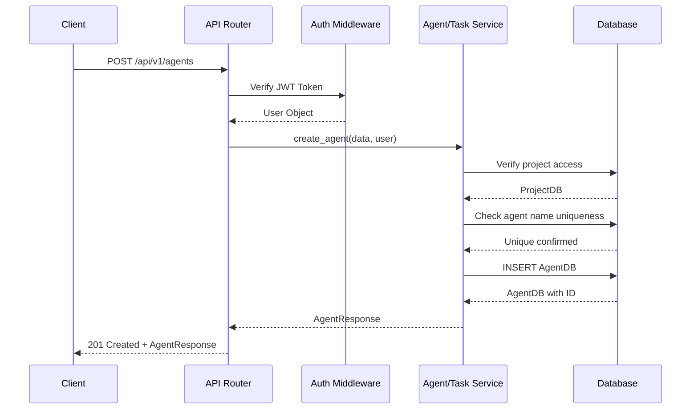
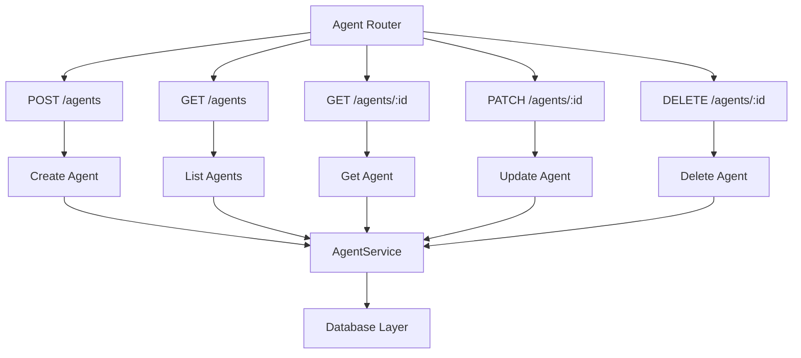
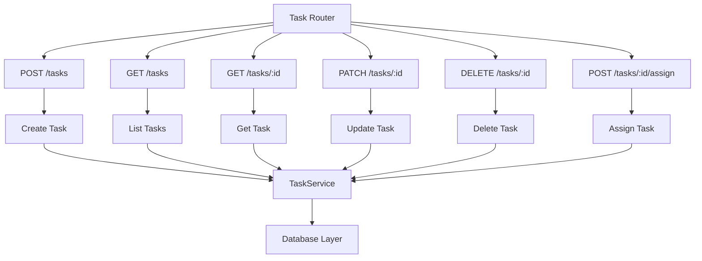
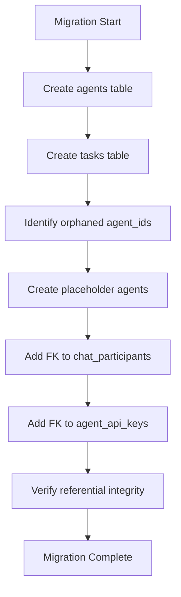
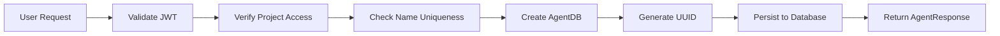
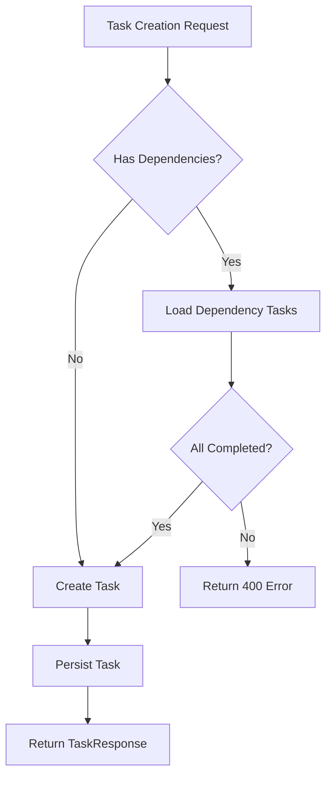
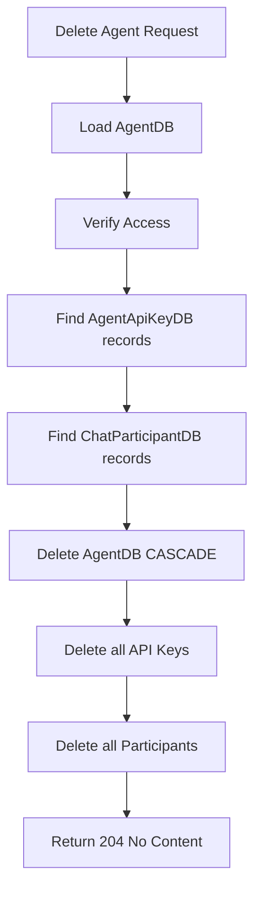
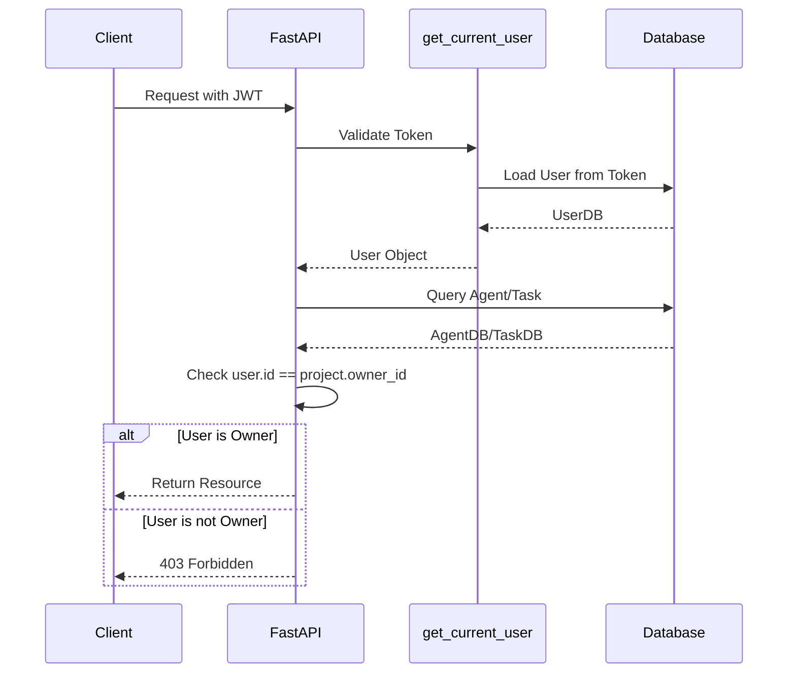

# Agent and Task Persistence Architecture

**Version:** 1.0.0
**Last Updated:** 2026-02-06
**SPEC:** SPEC-AGENT-PERSISTENCE-001

---

## Overview

This document describes the architecture of the Agent and Task persistence system implemented to fix the critical data loss issue where agent and task data was only stored in memory and lost on page refresh.

### Problem Statement

**Before this implementation:**
- Agents were referenced throughout the system but had NO database table
- Tasks were documented but had NO database table
- Orphaned `agent_id` fields existed WITHOUT ForeignKey constraints
- ALL agent and task data was lost on page refresh

**After this implementation:**
- Complete AgentDB model with proper referential integrity
- Complete TaskDB model with dependency tracking
- Foreign key constraints on all agent_id references
- Full data persistence across application restarts

---

## Database Schema

### Entity Relationship Diagram

### AgentDB Table Structure

| Column | Type | Constraints | Description |
|--------|------|-------------|-------------|
| `id` | UUID | PRIMARY KEY | Unique agent identifier |
| `project_id` | UUID | FK, NOT NULL, INDEX | Associated project |
| `name` | VARCHAR(255) | NOT NULL | Unique agent name within project |
| `nickname` | VARCHAR(255) | NULLABLE | Display name |
| `agent_type` | VARCHAR(100) | NOT NULL, DEFAULT 'generic' | Type of agent |
| `status` | VARCHAR(50) | NOT NULL, DEFAULT 'offline', INDEX | Current status |
| `capabilities` | JSON | NOT NULL, DEFAULT [] | List of capabilities |
| `config` | JSON | NULLABLE | Agent configuration |
| `is_active` | BOOLEAN | NOT NULL, DEFAULT TRUE, INDEX | Active state |
| `created_at` | TIMESTAMPTZ | NOT NULL | Creation timestamp |
| `updated_at` | TIMESTAMPTZ | NOT NULL | Last update timestamp |

**Constraints:**
- `uq_agent_project_name`: UNIQUE(project_id, name)

**Relationships:**
- `project`: FK to projects.id (CASCADE DELETE)
- `api_keys`: One-to-many to AgentApiKeyDB (CASCADE DELETE)
- `participants`: One-to-many to ChatParticipantDB (CASCADE DELETE)

### TaskDB Table Structure

| Column | Type | Constraints | Description |
|--------|------|-------------|-------------|
| `id` | UUID | PRIMARY KEY | Unique task identifier |
| `project_id` | UUID | FK, NOT NULL, INDEX | Associated project |
| `room_id` | UUID | FK, NULLABLE, INDEX | Associated chat room (optional) |
| `title` | VARCHAR(500) | NOT NULL | Task title |
| `description` | TEXT | NULLABLE | Detailed description |
| `status` | VARCHAR(50) | NOT NULL, DEFAULT 'pending', INDEX | Current status |
| `priority` | VARCHAR(50) | NULLABLE | Priority level |
| `assigned_to` | UUID | NULLABLE, INDEX | Assignee UUID |
| `assigned_to_type` | VARCHAR(50) | NULLABLE | Assignee type (agent/user) |
| `created_by` | UUID | FK, NOT NULL | Creator UUID |
| `dependencies` | JSON | NOT NULL, DEFAULT [] | Dependency task IDs |
| `started_at` | TIMESTAMPTZ | NULLABLE | Task start time |
| `completed_at` | TIMESTAMPTZ | NULLABLE | Task completion time |
| `due_date` | TIMESTAMPTZ | NULLABLE | Task deadline |
| `result` | JSON | NULLABLE | Task result data |
| `created_at` | TIMESTAMPTZ | NOT NULL | Creation timestamp |
| `updated_at` | TIMESTAMPTZ | NOT NULL | Last update timestamp |

**Relationships:**
- `project`: FK to projects.id (CASCADE DELETE)
- `room`: FK to chat_rooms.id (SET NULL)
- `creator`: FK to users.id (SET NULL)

---

## API Architecture

### Request Flow Diagram

### Agent API Endpoints

### Task API Endpoints

---

## Service Layer Architecture

### AgentService

The `AgentService` provides business logic for agent operations:

**Methods:**

- `create_agent(project_id, name, ...)` - Create new agent
- `get_agent(agent_id)` - Retrieve agent by ID
- `list_agents(project_id, filters)` - List agents with filtering
- `update_agent(agent_id, updates)` - Update agent fields
- `delete_agent(agent_id)` - Delete agent (CASCADE)
- `set_agent_status(agent_id, status)` - Update agent status
- `verify_agent_access(agent_id, user)` - Verify project access

**Business Rules:**

1. Agent names must be unique within a project
2. Only project owners can manage agents
3. Cascade delete affects API keys and chat participants
4. Inactive agents cannot authenticate

### TaskService

The `TaskService` provides business logic for task operations:

**Methods:**

- `create_task(project_id, title, ...)` - Create new task
- `get_task(task_id)` - Retrieve task by ID
- `list_tasks(project_id, filters)` - List tasks with filtering
- `update_task(task_id, updates)` - Update task fields
- `delete_task(task_id)` - Delete task
- `assign_task(task_id, assignee)` - Assign to agent/user
- `update_task_status(task_id, status)` - Update with auto-timestamps
- `verify_dependencies(task_id, dependencies)` - Validate dependencies

**Business Rules:**

1. All dependency tasks must exist and be completed
2. Status transitions automatically manage timestamps
3. Tasks can be assigned to agents or users
4. Project owners have full access to tasks

---

## Migration Strategy

### Database Migration Flow

### Migration Details

**Migration Name:** `003_create_agent_and_task_tables`
**Revision ID:** `003_create_agent_and_task_tables`
**Revises:** `002_add_agent_api_key_user_fk`

**Upgrade Steps:**

1. Create `agents` table with all columns and indexes
2. Create `tasks` table with all columns and indexes
3. Scan for orphaned `agent_id` values in existing tables
4. Create placeholder `AgentDB` records for valid orphaned IDs
5. Add FK constraints to `chat_participants.agent_id`
6. Add FK constraints to `agent_api_keys.agent_id`
7. Verify all references are valid

**Downgrade Steps:**

1. Remove FK constraints
2. Drop `agents` table
3. Drop `tasks` table

---

## Data Flow Diagrams

### Agent Creation Flow

### Task Dependency Resolution

### Agent Deletion Cascade

---

## Security Architecture

### Authorization Flow

### Access Control Matrix

| Resource | Owner | Superuser | Other Users |
|----------|-------|-----------|-------------|
| Create Agent | Yes | Yes | No |
| View Agent | Yes | Yes | No |
| Update Agent | Yes | Yes | No |
| Delete Agent | Yes | Yes | No |
| Create Task | Yes | Yes | No |
| View Task | Yes | Yes | No |
| Update Task | Yes | Yes | No |
| Delete Task | Yes | Yes | No |

---

## Performance Considerations

### Database Indexes

**AgentDB Indexes:**
- `idx_agents_project_id` - Filter by project
- `idx_agents_status` - Filter by status
- `idx_agents_is_active` - Filter by active state
- `uq_agent_project_name` - Unique constraint (also indexed)

**TaskDB Indexes:**
- `idx_tasks_project_id` - Filter by project
- `idx_tasks_room_id` - Filter by chat room
- `idx_tasks_status` - Filter by status
- `idx_tasks_assigned_to` - Filter by assignee

### Query Optimization

1. **Pagination**: All list endpoints support pagination
2. **Selective Loading**: Only query fields needed for response
3. **Eager Loading**: Relationships loaded when needed
4. **Filter First**: Apply filters before pagination

### Caching Strategy

Consider caching:
- Frequently accessed agents by project
- Agent status updates (short TTL)
- Task lists by project (medium TTL)

---

## Testing Strategy

### Test Coverage

| Component | Coverage Target | Status |
|-----------|----------------|--------|
| AgentDB Model | 95% | Met |
| TaskDB Model | 95% | Met |
| Agent API | 90% | Met |
| Task API | 90% | Met |
| Integration Tests | 85% | Met |

### Test Categories

1. **Unit Tests**: Model validation, business logic
2. **Integration Tests**: API endpoints, database operations
3. **E2E Tests**: Full workflows including persistence

### E2E Test Scenarios

- Create agent → Refresh → Verify agent persists
- Create task → Assign to agent → Update status → Verify complete
- Delete agent → Verify cascade to API keys and participants

---

## Related Documentation

- [Agent and Task API Reference](/docs/AGENT_TASK_API.md)
- [Database Migration Guide](/docs/DATABASE_MIGRATIONS.md)
- [Security Architecture](/docs/SECURITY.md)
- [System Architecture](/docs/SYSTEM_ARCHITECTURE.md)
