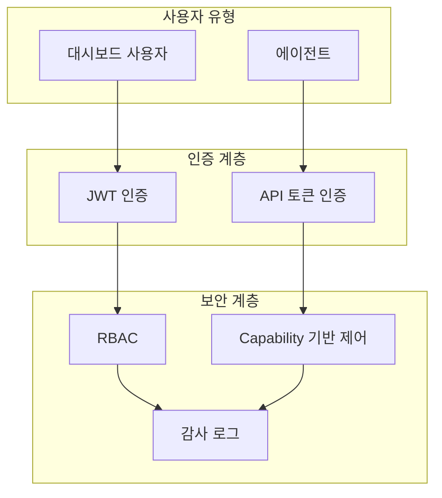

# 보안 인증 시스템

**버전:** 1.0.0
**최종 업데이트:** 2026-02-02
**플랫폼:** Multi-Agent Communication Platform

---

## 개요

AI Agent Communication System은 이중 인증 전략을 구현합니다:

- **대시보드 사용자**: JWT 기반 인증 (access/refresh 토큰)
- **에이전트**: API 토큰 기반 인증 (bearer 토큰)

### 보안 아키텍처



## Architecture

```
src/communication_server/security/
├── __init__.py           # Module exports
├── tokens.py             # JWT and API token generation/validation
├── auth.py               # AuthService for user/agent authentication
├── dependencies.py       # FastAPI dependencies for protected routes
└── middleware.py         # Authentication and security middleware

src/agent_comm_core/models/auth.py  # Pydantic models for authentication
```

## Environment Variables

Required environment variables (see `.env.example`):

```bash
# JWT Configuration (Dashboard)
JWT_SECRET_KEY=your-super-secret-key-min-32-chars
JWT_ALGORITHM=HS256
ACCESS_TOKEN_EXPIRE_MINUTES=15
REFRESH_TOKEN_EXPIRE_DAYS=7

# API Token Configuration (Agents)
API_TOKEN_SECRET=your-api-token-secret
API_TOKEN_PREFIX=agent_

# Admin Credentials
ADMIN_USERNAME=admin
ADMIN_PASSWORD=change-me-immediately
```

### Generating Secure Keys

```bash
# JWT Secret Key
python -c 'import secrets; print(secrets.token_urlsafe(32))'

# API Token Secret
python -c 'import secrets; print(secrets.token_urlsafe(32))'
```

## Authentication API Endpoints

### Dashboard User Authentication

#### Login
```http
POST /api/v1/auth/login
Content-Type: application/json

{
  "username": "admin",
  "password": "your-secure-password"
}
```

Response:
```json
{
  "access_token": "eyJ0eXAiOiJKV1QiLCJhbGc...",
  "refresh_token": "eyJ0eXAiOiJKV1QiLCJhbGc...",
  "token_type": "bearer",
  "expires_in": 900
}
```

#### Refresh Token
```http
POST /api/v1/auth/refresh
Content-Type: application/json

{
  "refresh_token": "eyJ0eXAiOiJKV1QiLCJhbGc..."
}
```

#### Get Current User
```http
GET /api/v1/auth/me
Authorization: Bearer <access_token>
```

#### Logout
```http
POST /api/v1/auth/logout
Authorization: Bearer <access_token>
Content-Type: application/json

{
  "refresh_token": "eyJ0eXAiOiJKV1QiLCJhbGc..."
}
```

### Agent Token Management

#### Create Agent Token
```http
POST /api/v1/auth/agent-tokens
Authorization: Bearer <user_access_token>
Content-Type: application/json

{
  "project_id": "my-project",
  "nickname": "my-agent",
  "capabilities": ["communicate", "create_meetings"]
}
```

Response:
```json
{
  "token": "agent_my-project_my-agent_abc123...",
  "agent_id": "uuid-here",
  "message": "Store this token securely. It will not be shown again."
}
```

## Protected Routes

### For Dashboard Users (JWT)

```python
from fastapi import APIRouter, Depends
from communication_server.security.dependencies import get_current_user
from agent_comm_core.models.auth import User

@router.get("/api/v1/communications")
async def get_communications(
    user: User = Depends(get_current_user),
    service: CommunicationService = Depends(...),
):
    # Only authenticated users can access
    return await service.get_communications()
```

### For Agents (API Token)

```python
from fastapi import APIRouter, Depends
from communication_server.security.dependencies import require_agent
from agent_comm_core.models.auth import Agent

@router.post("/api/v1/communications")
async def log_communication(
    data: CommunicationCreate,
    agent: Agent = Depends(require_agent),
    service: CommunicationService = Depends(...),
):
    # Only authenticated agents can access
    return await service.log_communication(data, agent_id=agent.id)
```

### Role-Based Access Control

```python
from communication_server.security.dependencies import (
    get_current_admin,
    require_write_permission,
)

# Admin only
@router.delete("/api/v1/users/{user_id}")
async def delete_user(
    user_id: str,
    admin: User = Depends(get_current_admin),
):
    pass

# Write permission required
@router.post("/api/v1/settings")
async def update_settings(
    settings: Settings,
    user: User = Depends(require_write_permission),
):
    pass
```

### Capability-Based Access Control (Agents)

```python
from communication_server.security.dependencies import (
    require_communicate_capability,
    require_meeting_capability,
)

# Agent with communicate capability
@router.post("/api/v1/communications")
async def log_communication(
    data: CommunicationCreate,
    agent: Agent = Depends(require_communicate_capability),
):
    pass

# Agent with meeting creation capability
@router.post("/api/v1/meetings")
async def create_meeting(
    data: MeetingCreate,
    agent: Agent = Depends(require_meeting_capability),
):
    pass
```

## Security Features

### Password Requirements
- Minimum 12 characters
- Bcrypt hashing with 12 rounds
- Automatic salt generation

### JWT Token Security
- HS256 algorithm
- 15-minute access token expiration
- 7-day refresh token expiration
- Token blacklist for logout

### API Token Security
- Cryptographically secure random generation
- Bcrypt hashing for storage
- Constant-time comparison
- No expiration (manual revocation)

### Rate Limiting
- 60 requests per minute per IP
- In-memory storage (use Redis in production)

### Security Headers
- X-Content-Type-Options: nosniff
- X-Frame-Options: DENY
- X-XSS-Protection: 1; mode=block
- Content-Security-Policy
- Strict-Transport-Security
- Referrer-Policy
- Permissions-Policy

## Usage Examples

### Python Requests (Dashboard)

```python
import requests

# Login
response = requests.post(
    "http://localhost:8001/api/v1/auth/login",
    json={"username": "admin", "password": "your-password"}
)
tokens = response.json()
access_token = tokens["access_token"]

# Access protected endpoint
headers = {"Authorization": f"Bearer {access_token}"}
response = requests.get(
    "http://localhost:8001/api/v1/communications",
    headers=headers
)
```

### Python Requests (Agent)

```python
import requests

# Access protected endpoint with agent token
headers = {"Authorization": f"Bearer {agent_token}"}
response = requests.post(
    "http://localhost:8001/api/v1/communications",
    json={
        "from_agent": "agent-1",
        "to_agent": "agent-2",
        "message_type": "request",
        "content": "Hello!"
    },
    headers=headers
)
```

### cURL (Dashboard)

```bash
# Login
curl -X POST http://localhost:8001/api/v1/auth/login \
  -H "Content-Type: application/json" \
  -d '{"username":"admin","password":"your-password"}'

# Access protected endpoint
curl http://localhost:8001/api/v1/communications \
  -H "Authorization: Bearer <access_token>"
```

### cURL (Agent)

```bash
# Log communication
curl -X POST http://localhost:8001/api/v1/communications \
  -H "Authorization: Bearer <agent_token>" \
  -H "Content-Type: application/json" \
  -d '{
    "from_agent": "agent-1",
    "to_agent": "agent-2",
    "message_type": "request",
    "content": "Hello!"
  }'
```

## Production Considerations

1. **Use HTTPS**: Always use HTTPS in production
2. **Secure Secret Keys**: Use environment variables, never commit secrets
3. **Database Storage**: Replace in-memory storage with database
4. **Redis for Rate Limiting**: Use Redis instead of in-memory storage
5. **Change Default Admin**: Change admin credentials immediately
6. **Token Rotation**: Implement periodic token rotation
7. **Audit Logging**: Log all authentication events
8. **Session Management**: Consider session management for dashboard

## Security Best Practices

1. **Never log tokens**: Tokens should never appear in logs
2. **Use short expiration**: 15 minutes for access tokens is recommended
3. **Implement logout**: Always use token revocation on logout
4. **Validate input**: Always validate and sanitize user input
5. **Rate limit auth endpoints**: Prevent brute force attacks
6. **Monitor failed attempts**: Detect and block suspicious activity
7. **Use secure cookies**: For dashboard, use HttpOnly, Secure cookies
8. **Rotate keys periodically**: Change JWT_SECRET_KEY regularly

## Dependencies

```
python-jose[cryptography]>=3.3.0  # JWT handling
bcrypt>=4.0.0                     # Password hashing
passlib[bcrypt]>=1.7.4            # Password utilities
```

## License

Apache-2.0
