# Architecture Documentation

MCP Broker Server system architecture, component design, and data flow.

---

## Table of Contents

- [System Overview](#system-overview)
- [Component Architecture](#component-architecture)
- [Multi-Project Architecture](#multi-project-architecture)
- [Data Models](#data-models)
- [Message Flow](#message-flow)
- [Storage Layer](#storage-layer)
- [Security Architecture](#security-architecture)
- [Deployment Architecture](#deployment-architecture)

---

## System Overview

The MCP Broker Server is a centralized communication middleware that enables multiple Claude Code instances to discover each other, negotiate capabilities, and exchange messages using the Model Context Protocol (MCP) standard.

### Architecture Diagram

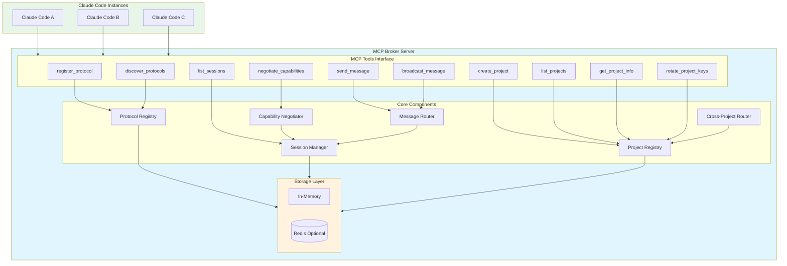

### Key Design Principles

1. **Async-First** - All I/O operations use asyncio for non-blocking execution
2. **Protocol-Agnostic** - Supports arbitrary communication protocols via JSON Schema
3. **Capability-Based** - Automatic negotiation determines compatible features
4. **Storage Abstraction** - Pluggable storage backends (memory, Redis)
5. **Security-First** - Authentication, CORS, and input validation built-in

---

## Component Architecture

### Protocol Registry

Manages protocol definitions with version tracking and JSON Schema validation.

**Responsibilities:**
- Store and retrieve protocol definitions
- Validate protocol schemas using JSON Schema Draft 7
- Support semantic versioning (semver)
- Prevent duplicate registrations
- Enable protocol discovery with filtering

**Key Methods:**
```python
async def register(protocol: ProtocolDefinition) -> ProtocolInfo
async def discover(name: str | None, version: str | None, tags: list[str] | None) -> list[ProtocolInfo]
async def get(name: str, version: str) -> ProtocolDefinition | None
async def validate_schema(schema: dict) -> ValidationResult
```

**Data Flow:**
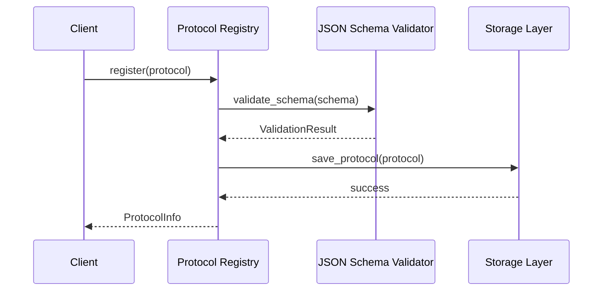

---

### Session Manager

Manages connected sessions with heartbeat monitoring and message queuing.

**Responsibilities:**
- Assign unique session IDs (UUID)
- Track session state (active, stale, disconnected)
- Monitor heartbeats and detect stale sessions
- Queue messages for offline recipients
- Manage graceful disconnection

**Key Methods:**
```python
async def create_session(capabilities: SessionCapabilities) -> Session
async def get_session(session_id: UUID) -> Session | None
async def update_heartbeat(session_id: UUID) -> None
async def list_sessions(status_filter: SessionStatus | None) -> list[Session]
async def disconnect_session(session_id: UUID) -> None
async def enqueue_message(recipient_id: UUID, message: Message) -> EnqueueResult
async def dequeue_messages(session_id: UUID) -> list[Message]
```

**Session Lifecycle:**
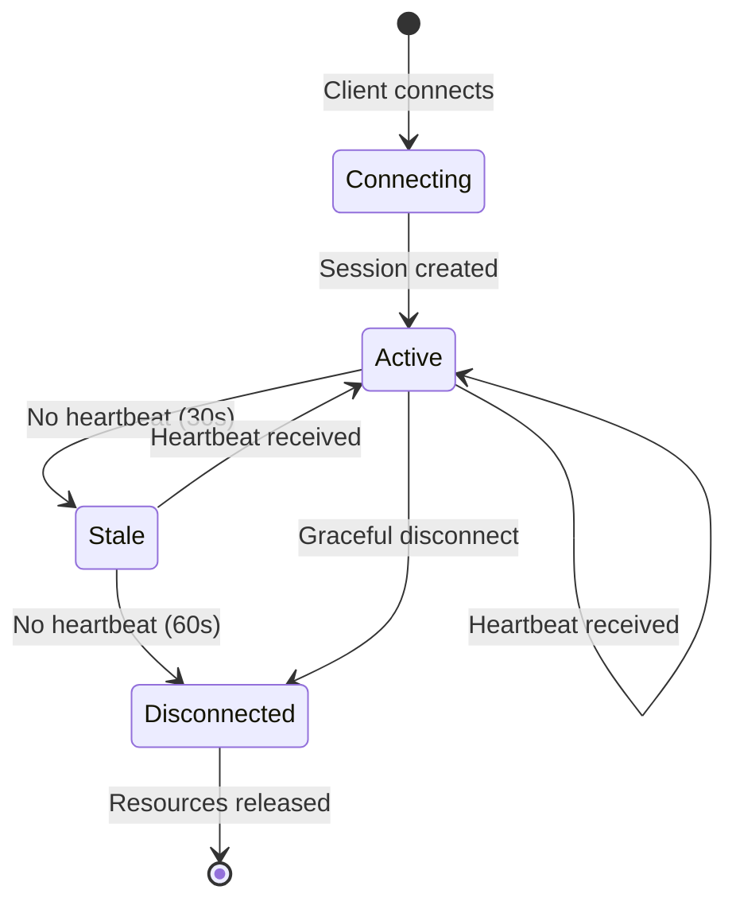

---

### Capability Negotiator

Performs capability negotiation between sessions with compatibility matrix computation.

**Responsibilities:**
- Exchange supported protocols and features
- Compute capability intersections
- Identify incompatibilities
- Provide upgrade suggestions

**Key Methods:**
```python
async def negotiate(
    session_a: Session,
    session_b: Session,
    required_protocols: list[ProtocolRequirement] | None
) -> NegotiationResult
async def check_compatibility(
    session: Session,
    protocol_name: str,
    protocol_version: str
) -> CompatibilityStatus
def compute_compatibility_matrix(sessions: list[Session]) -> CompatibilityMatrix
```

**Negotiation Flow:**
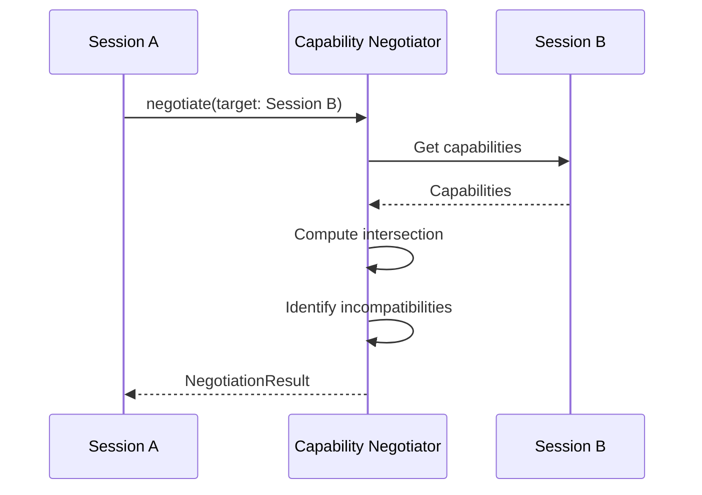

**Compatibility Matrix Example:**
| Session A | Session B | Compatible? | Common Features |
|-----------|-----------|-------------|-----------------|
| chat 1.0 | chat 1.0 | Yes | point_to_point, broadcast |
| chat 1.0 | chat 1.1 | Yes | point_to_point, broadcast |
| chat 1.0 | chat 2.0 | No | - |
| chat 1.0 + streaming | chat 1.0 | Yes | point_to_point, broadcast |

---

### Message Router

Routes messages between sessions with point-to-point and broadcast patterns.

**Responsibilities:**
- Point-to-point (1:1) message delivery
- Broadcast (1:N) message delivery
- Message queuing for offline recipients
- Protocol transformation (planned)
- Dead-letter queue for failed messages

**Key Methods:**
```python
async def send_message(
    sender_id: UUID,
    recipient_id: UUID,
    message: Message
) -> DeliveryResult
async def broadcast_message(
    sender_id: UUID,
    message: Message,
    capability_filter: dict | None
) -> BroadcastResult
async def transform_message(
    message: Message,
    from_version: str,
    to_version: str
) -> Message
```

**Message Flow (Point-to-Point):**
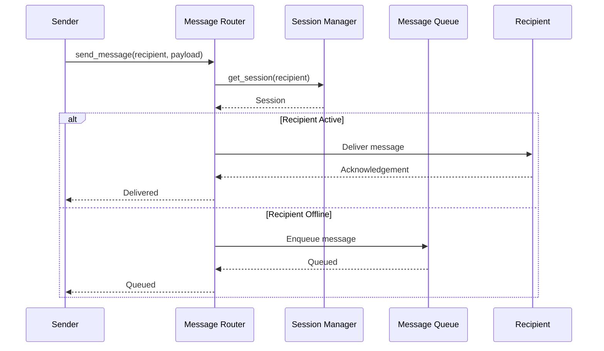

**Message Flow (Broadcast):**
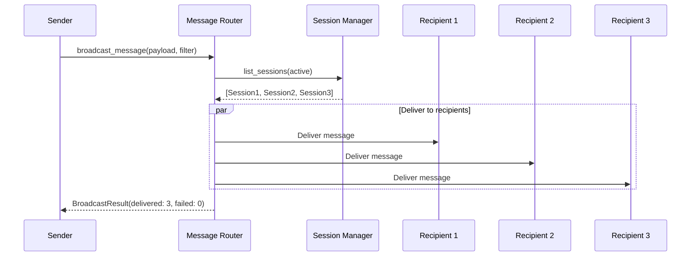

---

## Multi-Project Architecture

The MCP Broker Server supports multi-project isolation, allowing multiple independent projects to share the same broker instance while maintaining complete resource separation.

### Multi-Project Overview

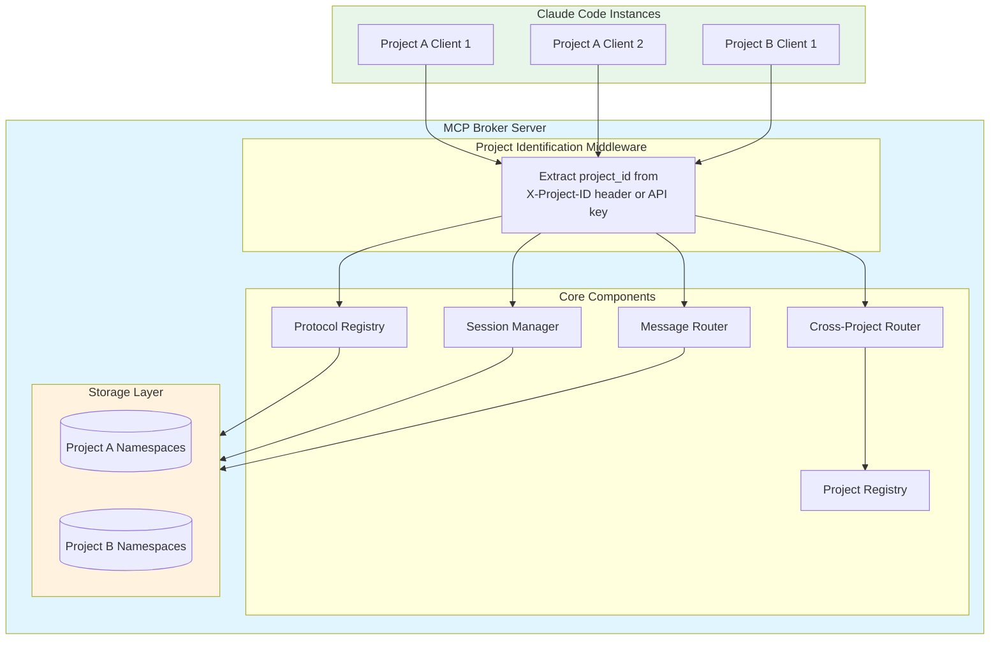

### Project Identification

Projects are identified using two methods (priority order):

1. **X-Project-ID Header** (Highest Priority)
   ```http
   GET /sessions
   X-Project-ID: project-a
   X-API-Key: broker_secret_key
   ```

2. **API Key Prefix**
   ```
   Format: {project_id}_{key_id}_{secret}
   Example: project-a_key1_abc123def456
   ```

3. **Default Project** (Fallback)
   - Used when no project identification is provided
   - Enables backward compatibility with single-project mode
   - All existing deployments automatically use "default" project

### Namespace-Based Isolation

Resources are isolated using namespace prefixing in the storage layer:

```
Storage Key Format: {project_id}:{resource_type}:{resource_id}

Examples:
- project-a:protocol:chat-1.0.0
- project-b:session:uuid123
- project-a:queue:uuid456
```

### Cross-Project Communication

Cross-project communication is **opt-in** and requires explicit permission:

**Permission Model:**
```python
class ProjectConfig(BaseModel):
    allow_cross_project: bool = False  # Opt-in flag

class CrossProjectPermission(BaseModel):
    target_project_id: str              # Allowed target project
    allowed_protocols: list[str]        # Protocol whitelist (empty = all)
    message_rate_limit: int             # Messages per minute (0 = unlimited)
```

**Permission Validation Flow:**
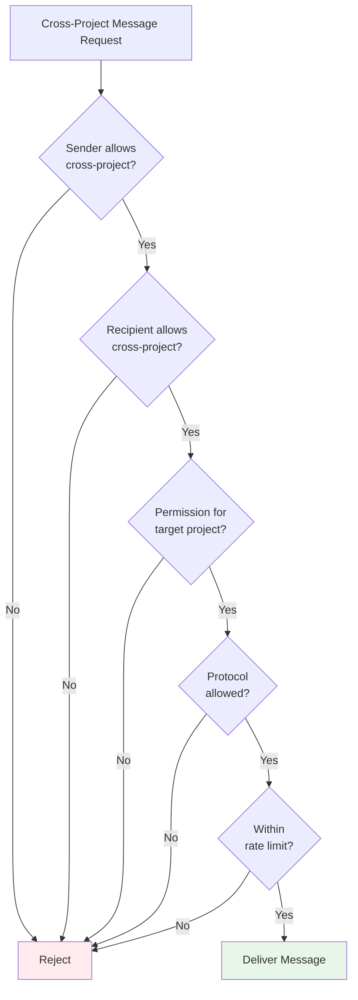

### Project Registry

The ProjectRegistry manages project definitions and API keys:

**Key Methods:**
```python
async def create_project(
    project_id: str,
    name: str,
    description: str | None = None,
    config: ProjectConfig | None = None,
    tags: list[str] | None = None
) -> ProjectDefinition

async def validate_api_key(api_key: str) -> tuple[str, str] | None
    # Returns (project_id, key_id) or None

async def list_projects(
    include_inactive: bool = False
) -> list[ProjectDefinition]
```

**Project Definition:**
```python
class ProjectDefinition(BaseModel):
    project_id: str
    metadata: ProjectMetadata
    api_keys: list[APIKey]
    config: ProjectConfig
    cross_project_permissions: list[CrossProjectPermission]
    created_at: datetime
```

### MCP Project Management Tools

Four new MCP tools for project management:

1. **create_project** - Create a new isolated project
   ```python
   await create_project(
       project_id="my-project",
       name="My Project",
       description="Project description",
       tags=["team-a", "production"]
   )
   ```

2. **list_projects** - List discoverable projects
   ```python
   projects = await list_projects()
   ```

3. **get_project_info** - Get project details
   ```python
   info = await get_project_info(project_id="my-project")
   ```

4. **rotate_project_keys** - Rotate API keys
   ```python
   new_keys = await rotate_project_keys(
       project_id="my-project",
       key_id="key1"
   )
   ```

### Backward Compatibility

Multi-project support is fully backward compatible:

- **Existing Deployments:** Automatically use "default" project
- **No Code Changes:** Existing MCP tools work without modification
- **Gradual Migration:** Projects can be created incrementally
- **Configuration:** Enable with `MCP_BROKER_ENABLE_MULTI_PROJECT=true`

### Storage Interface Extensions

All storage backend methods now support project_id:

```python
class StorageBackend(Protocol):
    async def get_protocol(
        self, name: str, version: str, project_id: str = "default"
    ) -> ProtocolDefinition | None

    async def save_protocol(
        self, protocol: ProtocolDefinition, project_id: str = "default"
    ) -> None

    async def get_session(
        self, session_id: UUID, project_id: str = "default"
    ) -> Session | None

    async def save_session(
        self, project_id: str, session: Session
    ) -> None
```

---

## Data Models

### Protocol Definition

```python
class ProtocolDefinition(BaseModel):
    name: str                              # Protocol identifier
    version: str                            # Semantic version
    schema: dict                            # JSON Schema
    capabilities: list[str]                 # Communication patterns
    metadata: ProtocolMetadata | None       # Optional metadata
```

**Schema Example:**
```json
{
  "$schema": "http://json-schema.org/draft-07/schema#",
  "type": "object",
  "properties": {
    "message": {"type": "string"},
    "sender": {"type": "string"},
    "timestamp": {"type": "string", "format": "date-time"}
  },
  "required": ["message", "sender"]
}
```

### Session

```python
class Session(BaseModel):
    session_id: UUID                        # Unique identifier
    project_id: str                         # Project for isolation (default: "default")
    connection_time: datetime               # Connection timestamp
    last_heartbeat: datetime                # Last heartbeat
    status: Literal["active", "stale", "disconnected"]
    capabilities: SessionCapabilities       # Supported protocols/features
    queue_size: int                         # Current message queue size
```

### Message

```python
class Message(BaseModel):
    message_id: UUID                        # Unique identifier
    sender_id: UUID                         # Sender session
    recipient_id: UUID | None               # Recipient (None for broadcast)
    timestamp: datetime                     # Creation timestamp
    protocol_name: str                      # Protocol for validation
    protocol_version: str                   # Protocol version
    payload: dict                           # Message content
    headers: MessageHeaders | None          # Priority, TTL, etc.
```

### Session Capabilities

```python
class SessionCapabilities(BaseModel):
    supported_protocols: dict[str, list[str]]  # protocol -> versions
    supported_features: list[str]               # Available features
```

---

## Storage Layer

### Storage Abstraction

The storage layer provides a unified interface for different backends:

```python
class StorageBackend(Protocol):
    async def get_protocol(name: str, version: str) -> ProtocolDefinition | None
    async def save_protocol(protocol: ProtocolDefinition) -> None
    async def get_session(session_id: UUID) -> Session | None
    async def save_session(session: Session) -> None
    async def enqueue_message(session_id: UUID, message: Message) -> None
    async def dequeue_messages(session_id: UUID, limit: int) -> list[Message]
```

### In-Memory Storage

**Characteristics:**
- Fast access (no network I/O)
- Ephemeral (lost on restart)
- Suitable for development and single-server deployments
- No external dependencies

**Data Structures:**
```python
class InMemoryStorage(StorageBackend):
    _protocols: dict[tuple[str, str], ProtocolDefinition]
    _sessions: dict[UUID, Session]
    _message_queues: dict[UUID, deque[Message]]
```

### Redis Storage

**Characteristics:**
- Persistent across restarts
- Supports distributed deployments
- Requires Redis server
- Automatic expiration support

**Data Structures:**
```python
class RedisStorage(StorageBackend):
    # Protocols: hash key = "protocol:{name}:{version}"
    # Sessions: hash key = "session:{uuid}"
    # Queues: list key = "queue:{uuid}"
```

### Storage Selection Flow

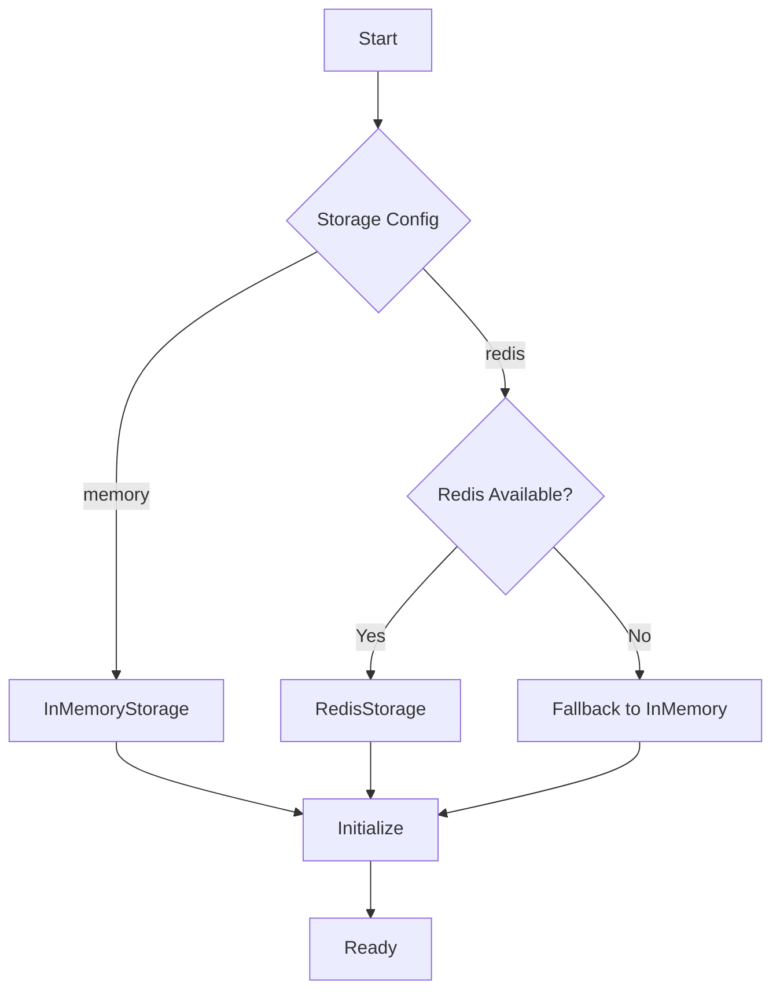

---

## Security Architecture

### Authentication Flow

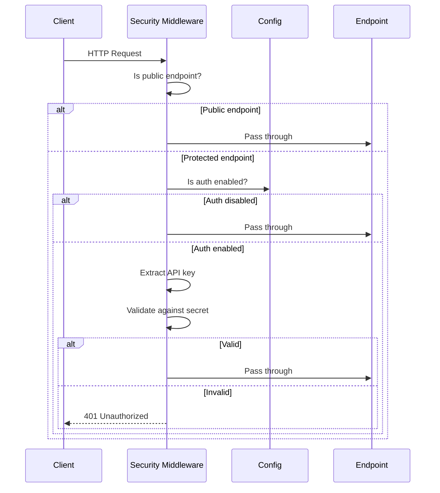

### Security Layers

1. **Authentication Middleware**
   - Validates API tokens
   - Supports header and cookie-based auth
   - Uses constant-time comparison (timing-attack safe)

2. **Input Validation**
   - Pydantic schema validation for all inputs
   - JSON Schema validation for protocol definitions
   - Maximum payload size limits

3. **CORS Protection**
   - Configurable allowed origins
   - Credentials support
   - Pre-flight handling

4. **Log Redaction**
   - Sensitive data redacted from logs
   - Authentication tokens never logged
   - PII protection

---

## Deployment Architecture

### Single-Server Deployment

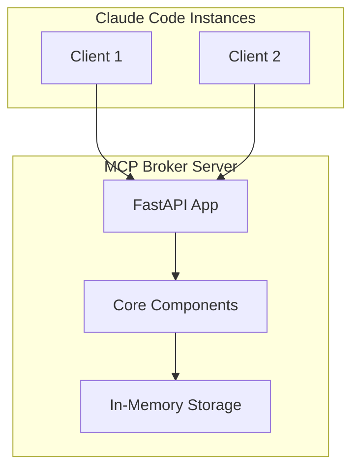

### Distributed Deployment with Redis

```mermaid
flowchart TB
    subgraph Clients["Claude Code Instances"]
        C1[Client 1]
        C2[Client 2]
        C3[Client 3]
    end

    subgraph LB["Load Balancer"]
        LB[Nginx / HAProxy]
    end

    subgraph Servers["Broker Servers"]
        B1[Broker 1]
        B2[Broker 2]
        B3[Broker 3]
    end

    subgraph Storage["Redis Cluster"]
        R1[(Redis Primary)]
        R2[(Redis Replica)]
        R3[(Redis Replica)]
    end

    C1 --> LB
    C2 --> LB
    C3 --> LB

    LB --> B1
    LB --> B2
    LB --> B3

    B1 --> R1
    B2 --> R1
    B3 --> R1

    R1 -.->|replication| R2
    R1 -.->|replication| R3
```

### Deployment Considerations

**Horizontal Scaling:**
- Stateless design allows multiple broker instances
- Redis provides shared state
- Load balancer distributes connections

**High Availability:**
- Redis replication for data durability
- Multiple broker instances for fault tolerance
- Graceful degradation when Redis unavailable

**Performance:**
- In-memory storage for low latency
- Connection pooling for Redis
- Async I/O for high concurrency

---

## Performance Characteristics

### Expected Performance

| Operation | Target Latency | Notes |
|-----------|----------------|-------|
| Protocol registration | < 50ms | Local: < 10ms |
| Session creation | < 20ms | Memory only |
| Capability negotiation | < 30ms | 2 sessions |
| Point-to-point message | < 100ms | Local delivery |
| Broadcast message | < 500ms | 50 recipients |

### Scalability Targets

- **Concurrent Sessions:** 50+ (tested), 200+ (theoretical)
- **Message Throughput:** 1000+ messages/second
- **Protocol Registry:** 100+ protocols
- **Storage:** Limited by RAM (in-memory) or Redis capacity

---

## Related Documentation

- [API Reference](api.md) - HTTP endpoints and MCP tools
- [README.md](../README.md) - Project overview and quick start
- [MCP Specification](https://modelcontextprotocol.io/) - Official MCP documentation
